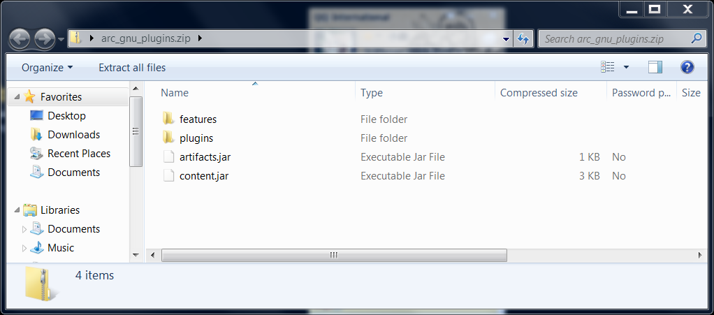
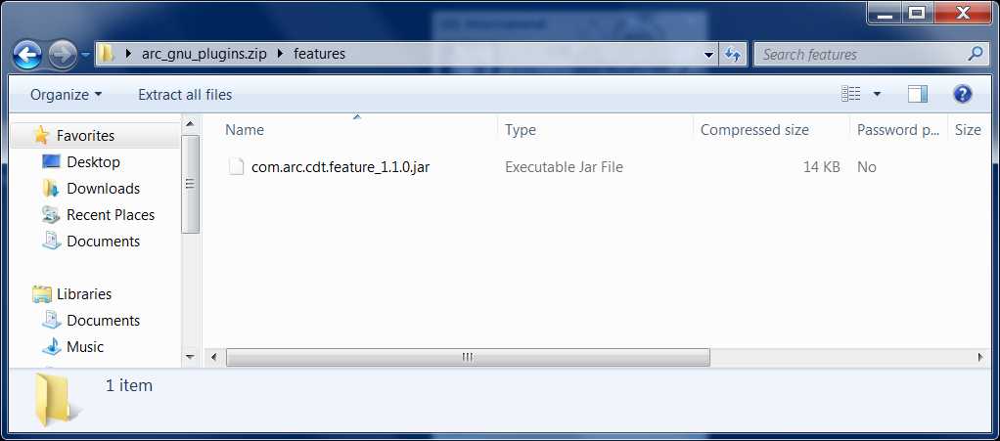

# Introduction

The ARC GNU Eclipse IDE consists of the Eclipse IDE combined with an Eclipse CDT Managed Build Extension plug-in for the ARC GNU Toolchain and GDB embedded debugger plug-in for ARC, based on the Zylin Embedded CDT plug-in. 
The ARC GNU IDE supports the development of managed C/C++ applications for ARC processors using the ARC GNU toolchain for bare metal applications (elf32).  

The ARC GNU IDE provides support for the following functionality: 
* 	Support for Windows Development Host Systems
* 	Support for the ARC EM Processor development target
* 	Ability to create C/C++ projects using the ARC elf32 cross-compilation toolchain
* 	Configuration of toolchain parameters per project
* 	Configuration of individual options (such as preprocessor, optimization, warnings, libraries, and debugging levels) for each toolchain component:
	* arc-elf32-gcc
	* arc-elf32-gdb
	* arc-elf32-as
	* arc-elf32-size
* 	Configuration of debug and run configurations for EM Starter Kit using OpenOCD. 
* 	Configuration of debug and run configurations for supported FPGA Development Systems and debug probes (Digilent HS1 or Ashling Opella-XD).
* 	GDB-based debugging using  **Debug**  perspective providing detailed debug information (including breakpoints, variables, registers, and disassembly)

Note: Before you begin, refer to the EM Starter Kit and ARC GDB Getting Started guide and follow the instructions on how to connect the EM Starter Kit to your PC.  This is required for the Eclipse IDE GDB debugger to successfully download and debug programs on the target.

# Installation
## Prerequisites
ARC GNU plugins for Eclipse have following requirements to the system:
* 	Eclipse version 4.3 (Kepler)
* 	CDT version 8.2.1
* 	OS: RHEL 6 or Windows 7
* 	On Linux both 32bit and 64-bit versions of Eclipse are supported, on Windows only 32-bit Eclipse installations are supported.  Eclipse 64-bit installation is not supported, so it is required to run 32-bit version of Eclipse on 64-bit Windows versions, to overcome this limitation.
* 	Java VM version >= 1.6 is required
## 2.1 Downloading latest plugins
User can get this plug-in from website URL https://github.com/foss-for-synopsys-dwc-arc-processors/arc_gnu_eclipse/releases, this is an archived version of the GNU ARC Eclipse plug-in update site, the file name is arc_gnu_plugins.zip

_Figure 1 Components of arc_gnu_plugins.zip_

_Figure 2 Components of arc_gnu_plugins.zip features_
To run ARC_GNU_IDE plugins, you need to install Target Terminal plugin. The url for Kepler’s update site is http://download.eclipse.org/releases/kepler, then select: Mobile and Device Development, especially Target Management Terminal which is "An ANSI (vt102) compatible Terminal including plug-ins for Serial, SSH and Telnet connections."
## 2.2: Installing into eclipse
After downloading arc_gnu_plugins.zip successfully, user also can install it from local by pointing Eclipse to it: Eclipse -> Install New Software -> Add -> Archive -> select arc_gnu_plugins.zip file. Unzip this archived folder, there will be six components in it.
 
## 2.3: Updating existing plugin
If users want to update the existing plugin, as shown in figure as below, and the version of this current plugin is for example “1.1.0.201402280630”, they can update it by using the same way of plugin installation.

## 2.4: Linux installation

If you plan to connect to UART port on target board with RxTx plugin controlled by IDE you need to change permissions of dicrectory /var/lock in your system. Usually by default only users with root access are allowed to write into this directory, however RxTx tries to write file into this directory, so unless you are ready to run IDE with sudo, you need to allow write access to /var/lock directory for everyone. Note that if /var/lock is a symbolic link to another directory then you need to change permissions for this directory as well. For example to set required permissions on Fedora:

    $ ls -l /var/lock 
    lrwxrwxrwx. 1 root root 11 Jun 27  2013 /var/lock -> ../run/lock
    $ ls -ld /run/lock/
    drwxr-xr-x. 8 root root 160 Mar 28 17:32 /run/lock/
    $ sudo chmod go+w /run/lock
    $ ls -ld /run/lock/
    drwxrwxrwx. 8 root root 160 Mar 28 17:32 /run/lock/
If you don’t want or can’t change permissions for this directory then you need to disable serial port in debugger configuration window.
# Building a C Project
## Step 1: Creating a New C Project
1. Select **File >New >C Project** 
The **C Project** dialog has two ARC project types:  **ARC Cross ELF32 Target Application** and **ARC Cross ELF32 Target Static Library**.   
Please note that different project types have different Tool Setting properties and different default options
2. Enter a project name
   1. Select **Hello World ARC C Project** under **ARC Cross ELF32 Target Application**.   
The Hello ARC project is an example project that comes with the EM Starter Kit Software and uses the UART on the EM Starter Kit to display output.  Refer to the EM Starter Kit Getting Started for instructions on how to connect to the UART on the EM Starter Kit board using the Serial Terminal plugin.
   2. Select the little endian toolchain from **Toolchains** Pane ( EM Starter Kit configurations are little endian)
   3. Click the **Next** button.
3. You can also fill in additional information for a project. Afterwards, click the **Next** button
4. Select the desired configuration and click **Finish**

## Step 2: Configuring the ARC GNU Toolchain
Follow the steps below to configure the ARC GNU toolchain:

1. Right click on the Hello ARC project and select Properties from the pop-up menu:
2. Select desired options for each tool under the Tool Settings tab:

For example, select the Barrel shifter option for the EM Processor: 

Various options can be selected for the compiler, assembler and linker components of the toolchain as desired.  

Once the configuration options have been selected, click **Apply** and then **OK** to save the toolchain configuration. 
 
## Step 3: Building a Project
1. Right click on the _Hello ARC project_ and select **Build Project** from the pop-up menu
2. Review the build output log in the Eclipse console tab to confirm success:

## Step 4: Creating a Debug Configuration for the C Project

Once the C Project is successfully compiled by ARC GCC, you can debug the resulting executable on the EM Starter Kit board. 

To debug the project, create a new debug configuration using _arc-elf32-gdb_. 

1. Select **Debug Configurations**  from the  **Run**  menu or by clicking on the down arrow next to the bug icon: 
2. Double click on the **ARC C/C++ Application**  or click on the top left icon to create a new debug configuration for the project:
3. Select a name for the new debug configuration (by default, it equals the project name followed by “Debug”).
4. Click the **Debugger** tab.
Select the **JTAG via OpenOCD** or **JTAG via Ashling** for use with EM Starter Kit. Select the nSIM for use simulator without hardware be connected.   
5. Click the **Commands** tab.
    The default **“Initialize”** and **“Run”** commands is null, you can use them directly, or modify the list as desired. The “COM Ports” picklist shows the value for Digilent USB Serial Port from the Windows registry. You can modify the value as desired, but the selection must match the port number in Device and Printers as shown in below.
    To make USB Serial COM Port on Linux, users need to connect hardware through Virtual Machine as shown in below.
    Then by running “sudo chmod o+rw /dev/ttyUSB*” and “sudo chown root.uucp /var/lock/”, users can get Digilent USB Serial COM Port list on Redhat. After connected successfully, Digilent USB Serial COM Port on windows device will be found.
6. Click the Debug button in the Debug configurations dialog to initiate debug session. 
This action automatically launches the Serial terminal and OpenOCD applications in the background and connects to the UART on the EM Starter Kit board. After checking the “Allocate console (necessary for input)" in **Common Tab**, OpenOCD startup log messages will appear in the console. 
7. Click **Yes** in the confirmation dialog to switch to the Debug perspective
8. Click the **Debug** button in the **Debug configurations** dialog to initiate the debug session:

## Step 5: Debugging an Application
The **Debug** perspective provides an integrated debug environment with individual windows to display various debugging data such as the debug stack, variables, registers  breakpoints, etc. 

1. To set a breakpoint, place your cursor on the marker bar along the left edge of the editor window on the line where you want the breakpoint:
2. Examine Variables, Breakpoints, Expressions or Registers from different tabs of the same debug perspective: 
3. Examine the debug Views showing the debugger in use:
4. Switch Console tabs to view OpenOCD **Console** output:  
5. Step through each line by using F5 (step into), and F6 (step over). 
6. Toggle breakpoint at the last line of main(), which is "}" , and then clicking Resume or pressing F8.
7. Terminate all external tools before you quit current debugging process.

# Appendix: Debugging a big-endian Application

The EM Starter Kit comes with 4 pre-installed little endian configurations.   User wishing to work with big endian configuration can use the procedure below to program a big endian .bit file, using the Digilent Adept Software. Big endian .bit file is not a part of the EM Starter Kit Software package, Synopsys will provide it on request. 

1. Ensure that EM SK is powered ON and connected to the host PC
2. On the EM Starter Kit, close jumper J8 as shown in images below: 
3. Dowload the Digilent Adept 2.13.1 System Software for Windows from 
 http://www.digilentinc.com/Products/Detail.cfm?Prod=ADEPT2
4. Open the "Adept" utility
5. Press "Initialize chain". There should be only one device in a chain: XC6SLX45.  
6. Press "Browse" button and navigate to location of your big endian .bit file 
7. Press "Program" button.
8. Return  Jumper J8 to its initial position. 
9. In Debug Configuration panel, select big endian configuration file under
$INSTALL_DIR\share\openocd\scripts\target\snps_starter_kit_arc-em_eb.cfg

The EM Starter Kit will now use the selected big-endian FPGA image until the board is powered off or until reconfiguration by pressing the FPGA configuration button located above the “C” in the “ARC” log on the board. Refer to EM Starter Kit documentation for more details.