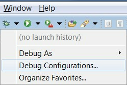
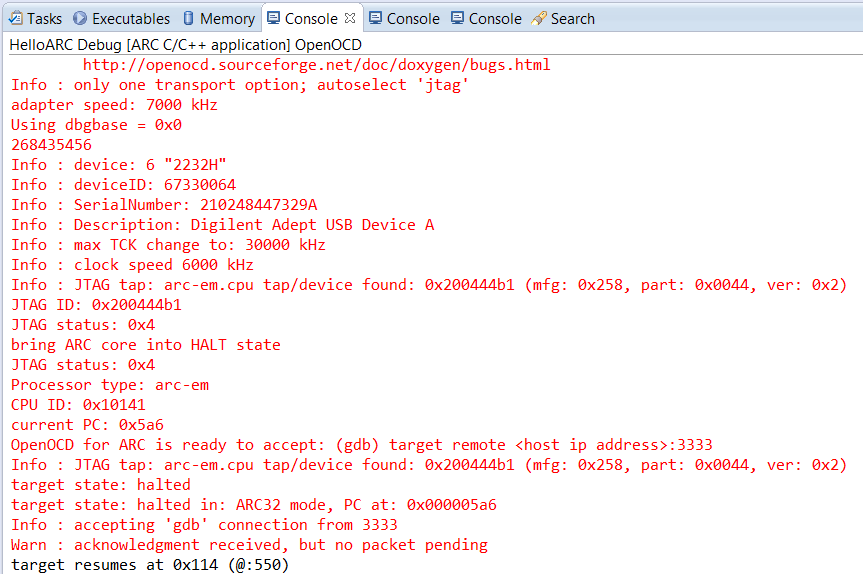
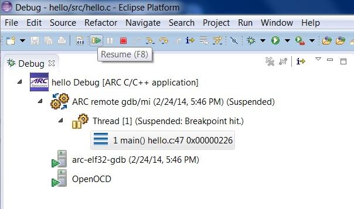
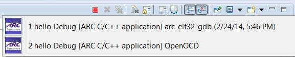

TOC
===

* [Installation](Installation)
* [Building a C Project](Building-a-C-Project)
* [Debugging with nSIM](Debugging-with-nSIM)
* [Building and Debugging Linux uClibc applications]
  (Building-and-Debugging-Linux-uClibc-applications.md)
* [Debugging a big-endian application on EM Starter Kit]
  (Debugging-a-big-endian-Application-on-EM-Starter-Kit)

# Introduction

The ARC GNU Eclipse IDE consists of the Eclipse IDE combined with an Eclipse CDT Managed Build Extension plug-in for the ARC GNU Toolchain and GDB embedded debugger plug-in for ARC, based on the Zylin Embedded CDT plug-in. 
The ARC GNU IDE supports the development of managed C/C++ applications for ARC processors using the ARC GNU toolchain for bare metal applications (elf32).  

The ARC GNU IDE provides support for the following functionality: 
* 	Support for Windows 7, Ubuntu Linux 12.04 LTS and RedHat Enterprise Linux 6.0 Development Host Systems
* 	Support for the ARC EM and HS Processors
*	Support for little and big endian configurations
* 	Ability to create C/C++ projects using the ARC elf32 cross-compilation toolchain
* 	Configuration of toolchain parameters per project
* 	Configuration of individual options (such as preprocessor, optimization, warnings, libraries, and debugging levels) for each toolchain component:
	* arc-elf32-gcc
	* arc-elf32-gdb
	* arc-elf32-as
	* arc-elf32-size
* 	Configuration of debug and run configurations for EM Starter Kit using OpenOCD. 
* 	Configuration of debug and run configurations for supported FPGA Development Systems and debug probes (Digilent HS1 or Ashling Opella-XD).
* 	GDB-based debugging using  **Debug**  perspective providing detailed debug information (including breakpoints, variables, registers, and disassembly)

Note: Before you begin, refer to the EM Starter Kit and ARC GDB Getting Started guide and follow the instructions on how to connect the EM Starter Kit to your PC.  This is required for the Eclipse IDE GDB debugger to successfully download and debug programs on the target.

#  Debugging with OpenOCD

## Step 1: Creating a Debug Configuration for the C Project

Once the C Project is successfully compiled by ARC GCC, you can debug the resulting executable on the EM Starter Kit board. 

To debug the project, create a new debug configuration using _arc-elf32-gdb_. 

1. Select **Debug Configurations**  from the  **Run**  menu or by clicking on the down arrow next to the bug icon: 

    

    _Debug Configurations_ 

2. Double click on the **ARC C/C++ Application**  or click on the top left icon to create a new debug configuration for the project:

    

    _ARC Embedded Debug Configurations_ 

3. Select a name for the new debug configuration (by default, it equals the project name followed by “Debug”).

    

    _New debug Configuration_ 

4. Click the **Debugger** tab.

    

    _Default values in the Debugger tab for JTAG via OpenOCD_ 

    

    _Default values in the GDBserver Debugger Options tab_ 

    Select the **JTAG via OpenOCD** or **JTAG via Ashling** for use with EM Starter Kit. Select the **nSIM** for use simulator without hardware be connected.  

    The “**COM Ports**” **picklist** shows the value for Digilent USB Serial Port from the Windows registry. You can modify the value as desired, but the selection must match the port number in Device and Printers as shown in below.

    

    _Digilent USB Serial COM Port_ 

    

    _USB Serial COM Port_ 

5. Click the **Commands** tab.

    

    _Default values in the Commands tab_ 

    The default **“Initialize”** and **“Run”** commands is null, you can use them directly, or modify the list as desired. 
   
6. Click the **Debug **button in the **Debug configurations** dialog to initiate debug session. 

    This action automatically launches the Serial terminal and OpenOCD applications in the background and   connects to the UART on the EM Starter Kit board. After checking the “Allocate console (necessary for input)" in **Common Tab**, OpenOCD startup log messages will appear in the console. 

    

    _Check “Allocate console” in Common Tab_ 

7. Click **Yes** in the confirmation dialog to switch to the Debug perspective

    

    _Perspective Switch_ 

    

    _Launch of OpenOCD_ 

    

    _Launch of Serial terminal_ 

8. Click the **Debug** button in the **Debug configurations** dialog to initiate the debug session:

    

    _Debugging Process_ 

## Step 2: Debugging an Application
The **Debug** perspective provides an integrated debug environment with individual windows to display various debugging data such as the debug stack, variables, registers  breakpoints, etc. 

_Debug Perspective_ 

1. To set a breakpoint, place your cursor on the marker bar along the left edge of the editor window on the line where you want the breakpoint:

    

    _Source File Window in Debug Perspective with Breakpoint Set_ 

2. Examine Variables, Breakpoints, Expressions or Registers from different tabs of the same debug perspective: 

    

    _Registers Window in Debug Perspective_ 

3. Examine the debug Views showing the debugger in use:

    

    _Debug Window in Debug Perspective_ 

    

    _Hello ARC Debug Console in Debug Perspective_ 

4. Switch Console tabs to view OpenOCD **Console** output:  

    

    _Multiple Consoles in the Debug Perspective_ 

    

    _Hello ARC Debug Console Output_ 

    

    _OpenOCD Console Output_ 

5. Step through each line by using F5 (step into), and F6 (step over). 

    

    _Stepping Toolbar_ 

6. Toggle breakpoint at the last line of main(), which is "}" , and then clicking Resume or pressing F8.

    

    _Click Resume or Press F8_ 

    

    _Final Output Printed to Serial Terminal Window through UART_ 
 
7. Terminate all external tools before you quit current debugging process.

    

    _Consoles for child processes_ 

