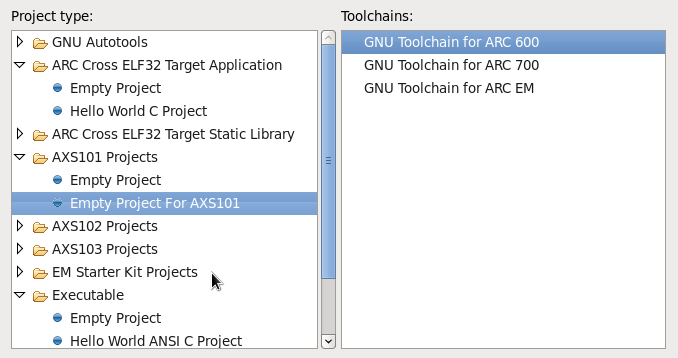

There are several ARC projects types available in the C project dialog:
**ARC Cross ELF32 Target Application**, **ARC Cross ELF32 Target Static
Library**, **AXS10x Projects**, **EM Starter Kit Projects**.

> Note: for each of these project types there is a list of toolchains which
> are supported by it.
> * **ARC Cross ELF32 Target Application** and **ARC Cross ELF32 Target Static
>  Library** support all of the toolchains,
> * **AXS101 Projects** supports ARC 600, ARC 700 and ARC HS toolchains,
> * **AXS102 Projects** and **AXS 103 Projects** support only ARC HS toolchain,
> * **EM Starter Kit Projects** -- only ARC EM toolchain.
>
> Project types are only available in the project creation dialog if at least one
> of the corresponding toolchain compilers is found in the `PATH` environment
> variable or in `../bin/` directory relative to Eclipse executable.
> Then you choose a project template, list of available toolchains appears on the
> right side of the dialog. There are only toolchains that are supported by this
> type of project and also found in the `PATH` or `../bin/` directory.

  _List of available toolchains for a template_

If you want to create an application for nSIM, choose **ARC Cross ELF32 Target
Application**. There you can choose either an empty or "Hello World" project
template. Please note that this "Hello World" project calls `printf()` function,
 so it can not be used on hardware development systems, since they use UART for
 input/output and libc library does not provide bindings between UART and
 C standard library I/O functions. For nSIM this project will work fine, but for
 hardware development systems please choose "Hello World" projects that use UART.
On the contrary, "Hello World" projects under **EM Starter Kit Projects** project
 type use UART, so they are not suitable for nSIM.

If you want to create a project for a hardware development system, choose one of
 **AXS10x Projects** or **EM Starter Kit Projects**. For each of these project
 types there is an **Empty Project** in the list of templates and also **Empty
 Project For** templates. If you want to create an empty project for your board,
 choose an empty project template that is specific for your board and core you
 are using. These templates contain memory maps of the cores, which are then
 passed to linker. As for **Empty Project** templates, they are generated
 automatically by Eclipse and do not contain any specific information, so you
 would have to provide a memory map yourself, or your application might not work
 properly.

  _Memory map for **Hello World for EM SK 2.1 Project**_

