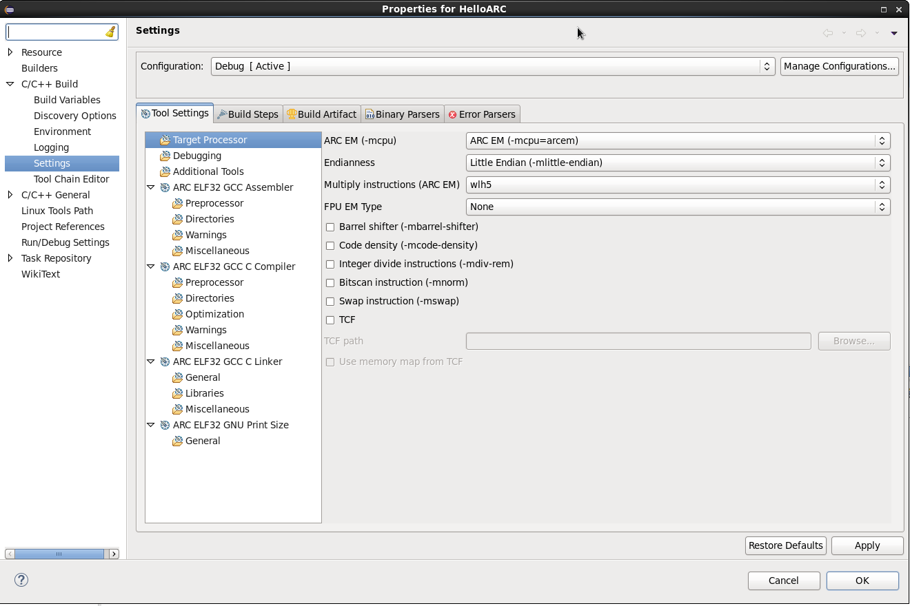
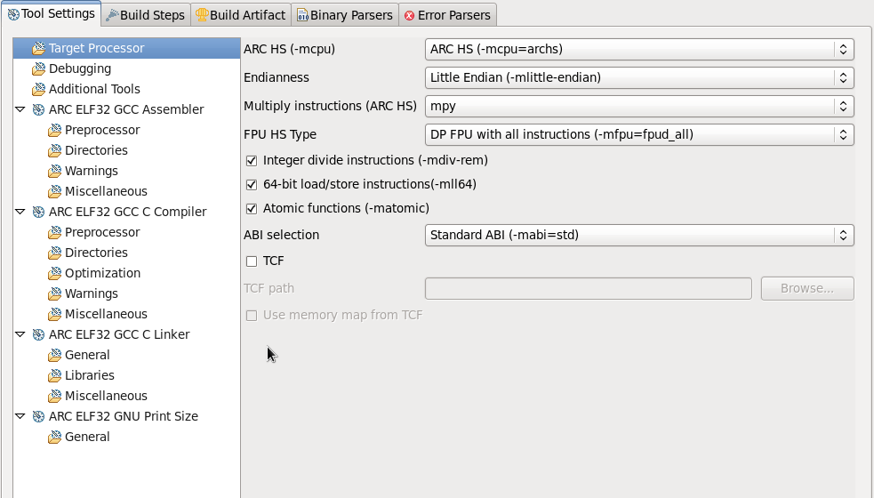
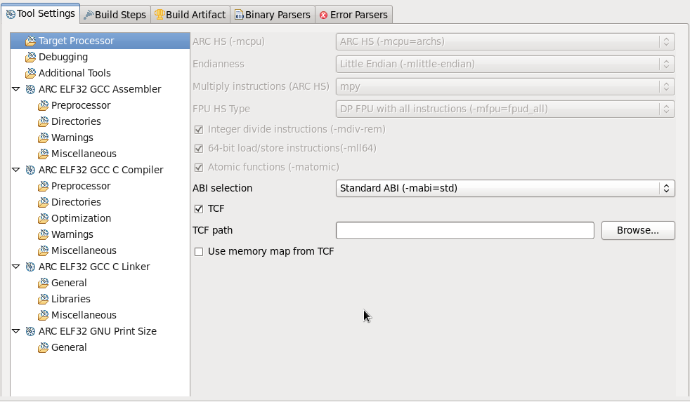
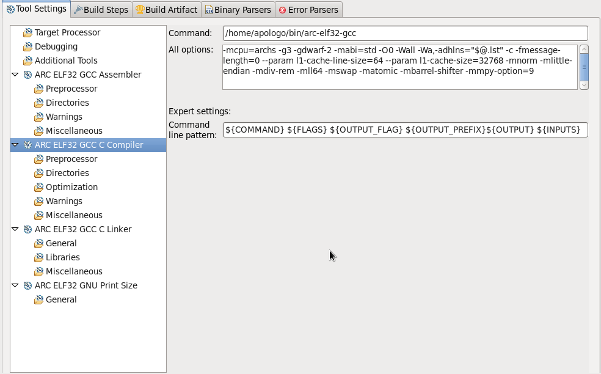
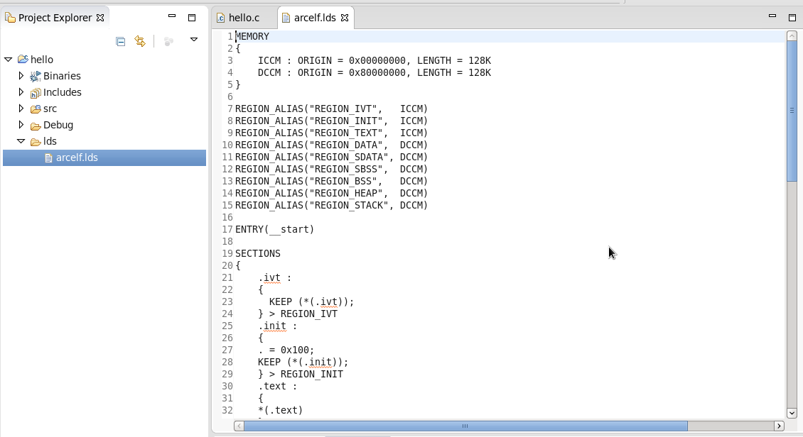

## Project Build Settings

To see your project build settings, right click on your project and select
 **Properties** from the pop-up menu. In the appeared dialog choose
 **C/C++ Build > Settings**, then select **Tool Settings** tab.

   _Project Build Settings page_

At the left of the tab there is a list of tools which are used to build your
 project and **Target Processor**, **Debugging** and **Additional Tools** pages.
For each of the listed tools there are some pages where you can set properties
 for these tools.

## Target Processor Page

On this page there are properties that describe your target. These properties
are different for different processors.

  _Target Processor Page for ARC HS_

* CPU and endianness options can not be changed, they are set when you choose
 a toolchain for your project.
* Other architecture options you can either set manually or choose a TCF file
 for used CPU core (available only for ARC EM and HS), which will set these options
 automatically. The only option that is not set automatically by selecting
a TCF file is **ABI selection** option, which is available only for ARC HS processors.

  _Target Processor Page for ARC HS with TCF checkbox selected_

It is recommended to use TCF files, because they are generated from the Build
 Configuration Registers and thus most reliably describe target core.
TCF files are provided by your chip designer.

To see which options are set automatically if TCF is chosen, you can select a
tool from the list on the left of the dialog and see the list of options to be
passed to this tool in the **All options** field.

  _List of all the options to be passed to compiler_

If **TCF** is selected, **Use memory map from TCF** checkbox becomes enabled.
If you check **Use memory map from TCF** box, memory map from TCF file will be
passed to the linker.

Note that templates from **AXS10x Projects** and **EM Starter Kit Projects**
already contain memory maps that are used if no other is provided. However,
this is true only for **Hello World for EM SK** and **Empty Project For**
templates, but not **Empty Project** ones. **Empty Project** templates are
generated automatically by Eclipse and do not contain any specific information.

  _Memory map for **Hello World for EM SK 2.1 Project**_
