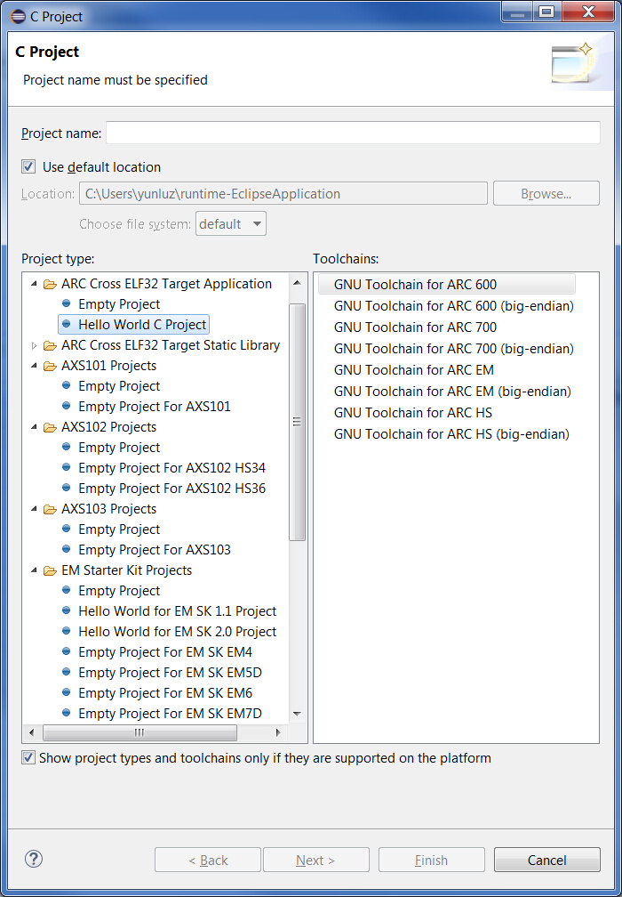
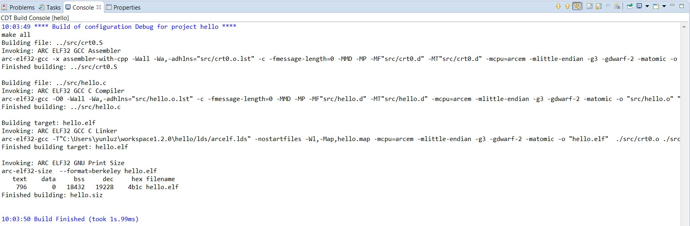

Creating a New C Project
------------------------

1. Select **File >New >C Project**

    

    _Creating a new C project_

    The **C Project** window has two ARC project types:  **ARC Cross ELF32 Target Application** and **ARC Cross ELF32 Target Static Library**. Please note that some projects types might support only particular toolchain, for example EM Starter Kit projects support only EM toolchain. Furthermore toolchain is available in a list only if it's compiler can be found in `PATH` environment variable or at `../bin/` directory relative to Eclipse executable. Therefore if you don't see required toolchain in the list, then you should check value of `PATH` environment variable.

2. Enter a project name

   

   _C Project Creation Dialog_

   1. Select **Hello World for EM SK 2.0 Project** under **ARC Cross ELF32
   Target Application**. The Hello ARC project is an example project that
   comes with the EM Starter Kit Software and uses the UART on the EM Starter
   Kit to display output. To see output printer to UART, connection to serial
   port should be established. By default Eclipse for ARC will automatically
   connect to available serial port, but that feature can be disabled and in
   that case refer to the EM Starter Kit Getting Started for instructions on
   how to connect to the UART on the EM Starter Kit board using Putty.

   2. Select the little endian GNU Toolchain for ARC EM from **Toolchains**
   pane.

   3. Click the **Next** button.

3. You can also fill in additional information for a project. Afterwards, click the **Next** button
    

    _C project creation - Additional information Dialog_
4. Select the desired configuration and click **Finish**
    

    _C Project creation – Configurations Dialog_

The resulting Hello ARC project created in Eclipse is:

_Final Hello ARC Project in Eclipse_

File changes could be required depending on version of EM Starter Kit. Users of EM Starter Kit version 1.1 should update file starterkit.h with new values of core and peripherals frequencies. Redefine CPU_CLOCK to 30000000 and PERIPHERAL_CLOCK to 50000000.

_File starterkit.h updated for EM Starter Kit 1.1_

Configuring the ARC GNU Toolchain
---------------------------------

Follow the steps below to configure the ARC GNU toolchain:

1. Right click on the Hello ARC project and select **Properties** from the pop-up menu:

    

    _Configuring the toolchain for the project_

2. Select desired options for each tool under the Tool Settings tab:

    

    _Toolchain Configuration_

    Various options can be selected for the compiler, assembler and linker components of the toolchain as desired.

    Once the configuration options have been selected, click **Apply** and then **OK** to save the toolchain configuration.

Note: Project templates provided with IDE for ARC already set processor potions to values specific to target development systems. However due to a bug in CDT, it is not possible to specify multiplier and FPU values in template.
  * For AXS103 projects, multiply instructions should be "9" and FPU should be maximum "-mfpu=fpud_all"
  * For EM SK v3 projects, multiply instructions should be "6". FPU should be maximum "-mfpu=fpud_all" for EM7D_FPU configuration.

Building a Project
------------------

1. Right click on the _Hello ARC project_ and select **Build Project** from the pop-up menu

    

    _Building a Project_

2. Review the build output log in the Eclipse console tab to confirm success:

    

    _Build Output_
