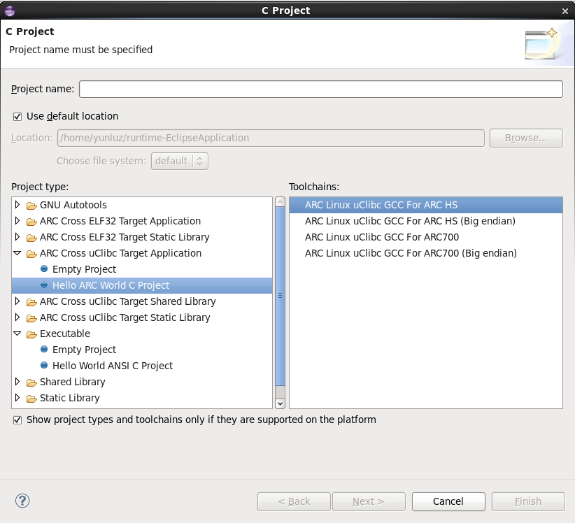
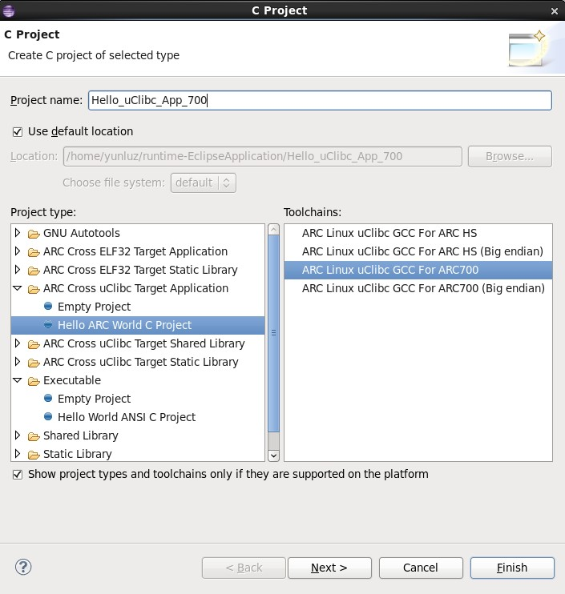
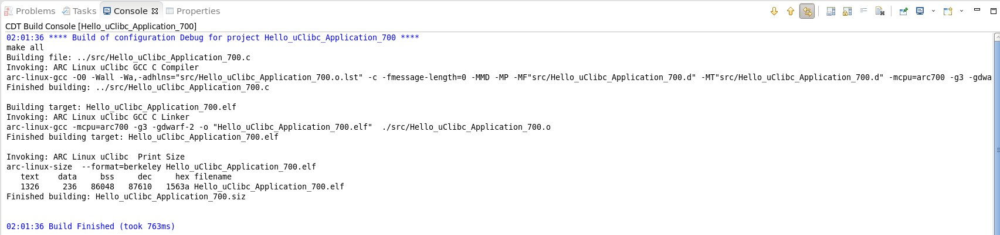
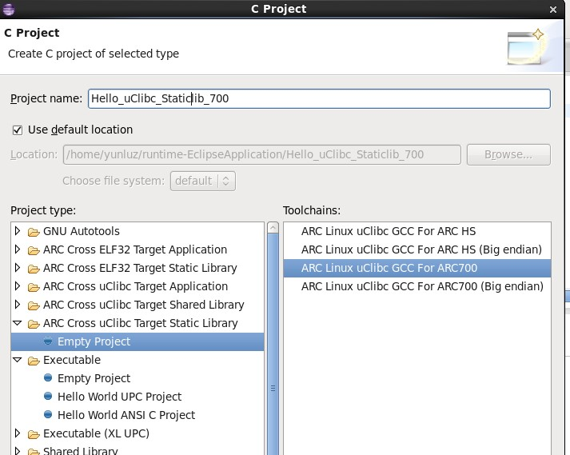
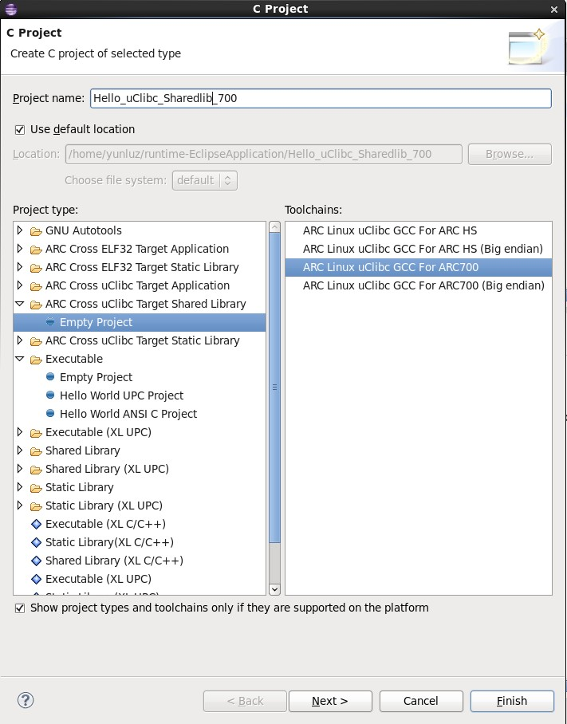
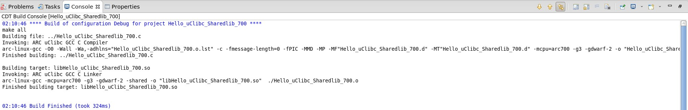

The C Project dialog has five ARC project types on Linux:  ARC Cross ELF32
Target Application, ARC Cross ELF32 Target Static Library,   ARC Cross uClibc
Target Application, ARC Cross uClibc Target Shared Library and ARC Cross uClibc
Target Static Library.

Creating a New C Project
------------------------

1. Select File >New >C Project
    

    _C Project Types on Linux_

Choosing toolchain
------------------

1. Choose proper toolchain for uClibc project type.
    

    _uClibc supported toolchain_

Setting compile options based on CPU core
-----------------------------------------
User should choose a proper toolchain for a core, for different core supports different compile options.

Compiling a uClibc application
------------------------------

    

    _Hello_uClibc_Application_700_

    

    _Hello_uClibc_Application_700_output.png_
Compiling a uClibc Shared Library
---------------------------------
    

    _Hello_uClibc_Staticlib_700_

    

    _Hello_uClibc_Staticlib_700_output_

Compiling a uClibc Static Library
---------------------------------
    

    _Hello_uClibc_Sharedlib_700_

    

    _Hello_uClibc_Sharedlib_700_output_
