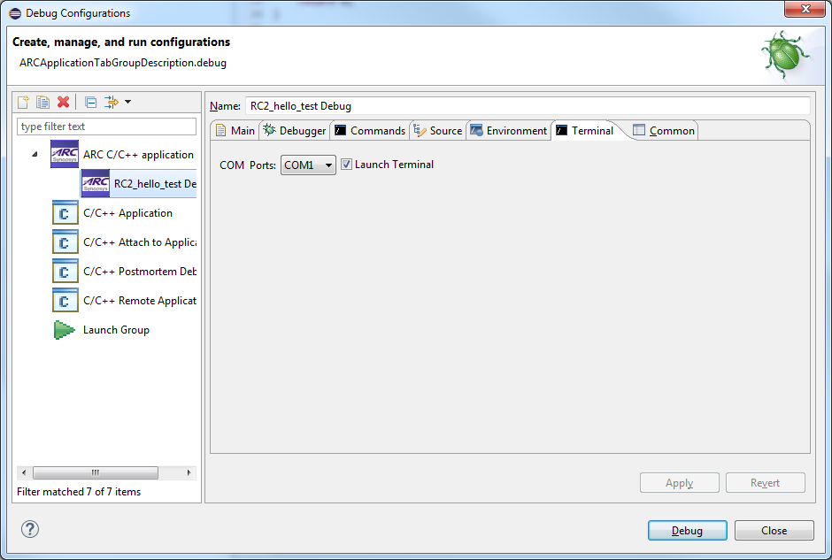
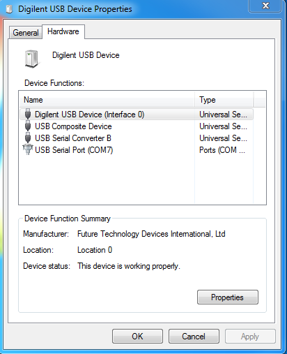

## Creating a new debug configuration

Once the C Project is successfully compiled by ARC GCC, you can debug the
resulting executable on a board or using nSIM.

To debug the project, create a new debug configuration.

1. Select **Debug Configurations**  from the  **Run**  menu or by clicking on
the down arrow next to the bug icon:

    

    _Debug Configurations_

2. Double click on the **ARC C/C++ Application**  or click on the top left icon
to create a new debug configuration for the project:

    ![ARC Embedded Debug Configurations]
    (images/debugging/arc_debug_configurations.png)

    _ARC Embedded Debug Configurations_

3. Select a name for the new debug configuration (by default, it equals the
project name followed by "Debug").

    

    _New debug Configuration_

4. Click the **Debugger** tab.

    ![Default values in the Debugger tab for JTAG via OpenOCD]
    (images/debugging/debugger_tab_default.jpg)

    _Default values in the Debugger tab for JTAG via OpenOCD_

    Here you can select a GDB server you want to use. About different GDB servers
and their settings see pages
  * [Debugging with OpenOCD](Debugging-with-OpenOCD)
  * [Debugging with Opella-XD](Debugging-with-OpellaXD)
  * [Debugging with nSIM](Debugging-with-nSIM)
  * [Debugging using custom GDB server](Debugging-with-Custom-GDB-Server)
  * [Using running GDB server](Debugging-with-Running-GDB-Server)

> There is a known problem with changing **ARC GDB Server**'s value on
> Ubuntu. After changing the value there are only two fields visible: **ARC GDB
> Server** and **Port number**. Workaround: select GDB server's value,
> press **Apply** button, then close and open the dialog again. After that all
> the necessary fields become visible.

## Setting a COM port

If you are debugging an application on a board you need to specify a COM port
to connect to. Open the **Terminal** tab.

  _Terminal Tab_

The **COM Ports** picklist shows the value for Digilent
USB Serial Port from the Windows registry. You can modify the value as
desired, but the selection must match the port number in Device and
Printers as shown in below.

  _Digilent USB Serial COM Port_

## Starting a debug session

5. Click the **Debug** button in the **Debug configurations** dialog or **Debug**
 button of IDE to initiate debug session.

  This action automatically launches your GDB server (if you are not connecting to
  a running one). If you are using a board, it also launches the Serial terminal
  and connects to your board.

6. Click **Yes** in the confirmation dialog to switch to the Debug perspective.

