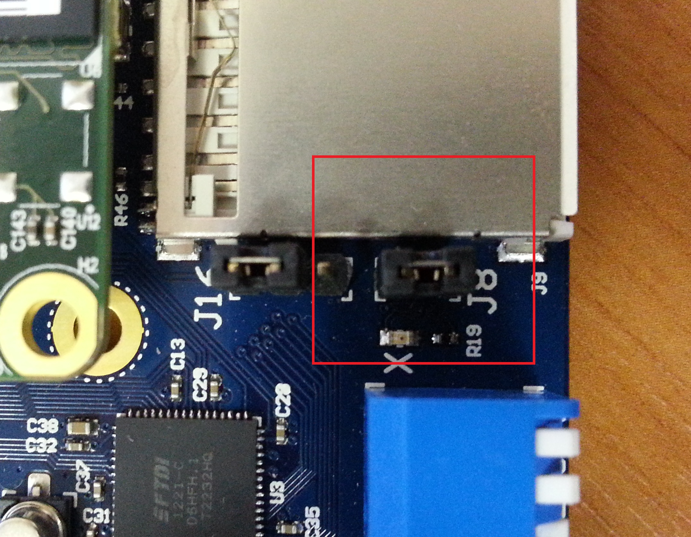

The EM Starter Kit comes with 4 pre-installed little endian configurations.
User wishing to work with big endian configuration can use the procedure below
to program a big endian .bit file, using the Digilent Adept Software. Big
endian .bit file is not a part of the EM Starter Kit Software package, Synopsys
will provide it on request.

1. Ensure that EM SK is powered ON and connected to the host PC

2. On the EM Starter Kit, close jumper J8 as shown in images below:

    ![J8 Jumper in factory default position]
    (images/J8 Jumper in factory default position.jpg)

    _J8 Jumper in factory default position_

    After closing the jumper:
    

    _J8 Jumper in closed position_

3. Download the Digilent Adept 2.13.1 System Software for Windows from
 http://www.digilentinc.com/Products/Detail.cfm?Prod=ADEPT2

4. Open the "Adept" utility

    ![Adept Utility before Initializing Chain]
    (images/Adept Utility before Initializing Chain.png)

    _Adept Utility before Initializing Chain_

5. Press "Initialize chain". There should be only one device in a chain: XC6SLX45.

    ![XC6SLX45 Device shown after Initialization]
    (images/XC6SLX45 Device shown after Initialization.png)

    _XC6SLX45 Device shown after Initialization_

6. Press "Browse" button and navigate to location of your big endian .bit file

7. Press "Program" button.

8. Return  Jumper J8 to its initial position.

9. In Debug Configuration panel, select big endian configuration file under
`$INSTALL_DIR\share\openocd\scripts\target\snps_starter_kit_arc-em_eb.cfg`

    ![Debug configuration window for big endian application]
    (images/Debug configuration window for big endian application.png)

    _Debug configuration window for big endian application_

The EM Starter Kit will now use the selected big-endian FPGA image until the
board is powered off or until reconfiguration by pressing the FPGA
configuration button located above the “C” in the “ARC” log on the board. Refer
to EM Starter Kit documentation for more details.
