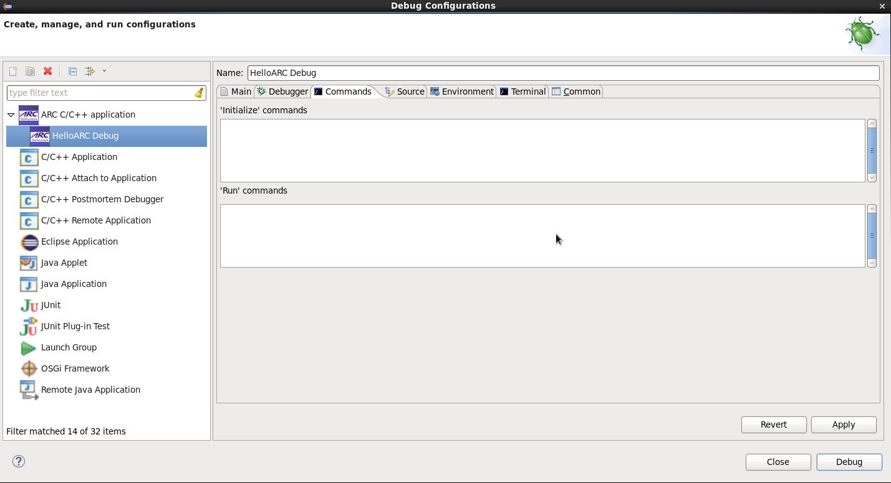

It is expected here that you have already built your application and created a
 debug configuration for it. About how to do it you can read on the following
pages:
* [Building an Application](Building-User-Guide)
* [Creating a Debug Configuration](Creating-a-Debug-Configuration)

### Specifying custom GDB server properties

_Custom GDB Server tab_

You can use some other GDB server. In that case you should specify a path to
this server executable file, its command-line arguments and also commands to
be passed to the GDB client. These are on the **Commands** tab of the dialog.

_Commands tab_

### OpenOCD as a custom GDB server

To use OpenOCD as a custom GDB server, user needs to specify command line options
for OpenOCD. It is not necessary to specify any commands for GDB on the
 **Commands** tab, it will connect to OpenOCD automatically.

  _Custom GDB server properties_

  _Debugging using custom GDB server_

