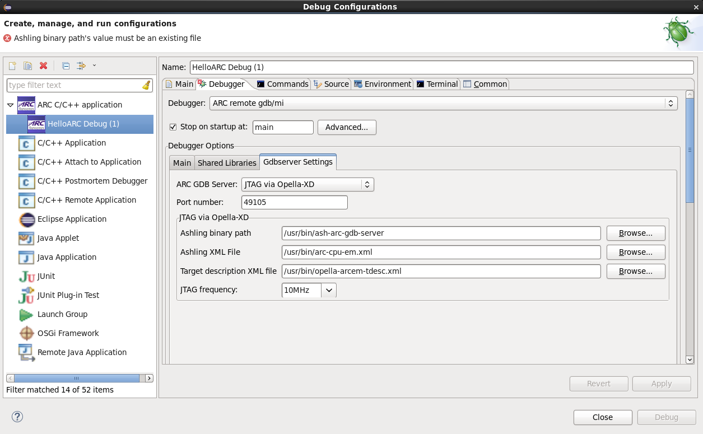

It is expected here that you have already built your application and created a
 debug configuration for it. About how to do it you can read on the following
pages:
* [Building an Application](Building-User-Guide)
* [Creating a Debug Configuration](Creating-a-Debug-Configuration)

> Note: Opella-XD has some problems, see **Known issues** section [here]
> (https://github.com/foss-for-synopsys-dwc-arc-processors/toolchain/wiki/AXS-SDP-and-Ashling-GDB-Server).

### Specifying properties for Opella-XD

_Opella-XD on debugger tab_

In this tab you should specify paths to your ashling executable file and two XML
files. Both these files you can find [here](https://github.com/foss-for-synopsys-dwc-arc-processors/toolchain/tree/arc-staging/extras/opella-xd).
In the **Ashling XML File** field you should choose one of `arc600-cpu.xml`,
`arc700-cpu.xml`, `arc-em-cpu.xml` and `arc-hs-cpu.xml`. In the
**Target description XML file** should be path to `opella-YOUR_CPU-tdesc.xml`.

### Starting a debug session

To debug an application using OpenOCD, press **Debug** button of IDE and confirm
switching to Debug Perspective.

  _Opella-XD properties_

  _Debugging process with Opella-XD_

