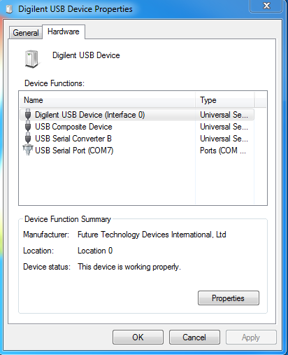

It is expected here that you have already built your application and created a
 debug configuration for it. About how to do it you can read on the following
pages:
* [Building an Application](Building-User-Guide)
* [Creating a Debug Configuration](Creating-a-Debug-Configuration)

### Board Configuration

For AXS 10x board configuration refer to [toolchain wiki
guide](https://github.com/foss-for-synopsys-dwc-arc-processors/toolchain/wiki/AXS-SDP-and-OpenOCD#board-configuration)
and User Guide of AXC00x CPU Card you are using.

For EM Starter Kit use default configuration.

### Configuring drivers on Windows

If you are using Windows, you should configure drivers for your device before
you start.

About how to do it see [How to Use OpenOCD on
Windows](How-to-Use-OpenOCD-on-Windows).

### Specifying OpenOCD properties

_OpenOCD debugger tab_

In this tab you can choose your development system and then in the **OpenOCD
 configuration file** field you will see a path to a file that will be used by
OpenOCD. If you want to use another configuration file, you can choose **Custom
configuration file** under **Development system** and select your own file in the
enabled **OpenOCD configuration file** field.

### Choosing COM Port

Open **Terminal** tab and select COM Port from the list. On Linux select
**/dev/ttyUSB1** for EM Starter Kit and **/dev/ttyUSB0** for AXS10x. On Windows
select COM port matching the port number from "Devices and Printers":

   _USB Serial COM Port_

### Starting a debug session

To debug an application using OpenOCD, press **Debug** button of IDE and confirm
switching to Debug Perspective.

  _Debugging Process_
