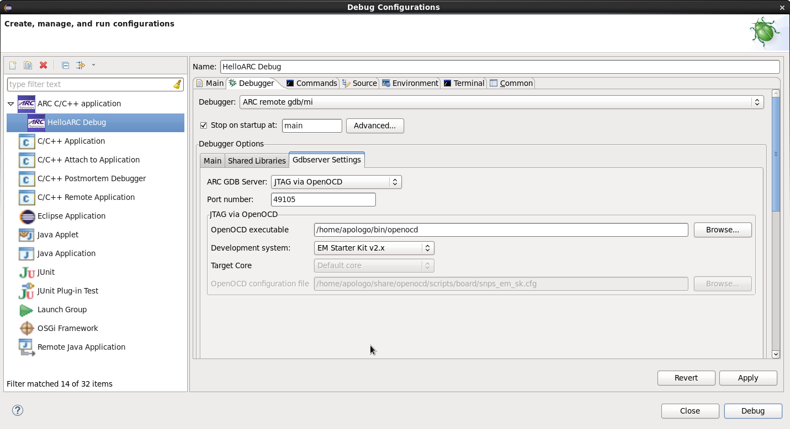

It is expected here that you have already built your application and created a
 debug configuration for it. About how to do it you can read on the following
pages:
* [Building an Application](Building-User-Guide)
* [Creating a Debug Configuration](Creating-a-Debug-Configuration)

### Specifying OpenOCD properties

_OpenOCD debugger tab_

In this tab you can choose your development system and then in the **OpenOCD
 configuration file** field you will see a path to a file that will be used by
OpenOCD. If you want to use another configuration file, you can choose **Custom
configuration file** under **Development system** and select your own file in the
enabled **OpenOCD configuration file** field.

### Starting a debug session

To debug an application using OpenOCD, press **Debug** button of IDE and confirm
switching to Debug Perspective.

  _Debugging Process_
