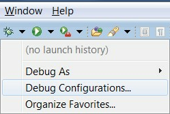
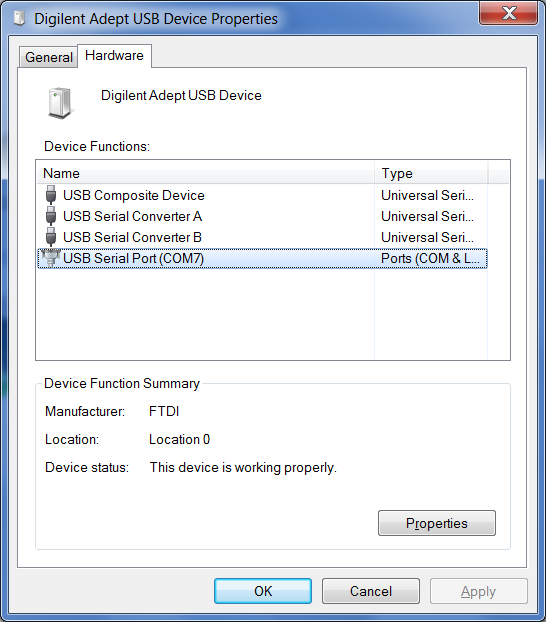
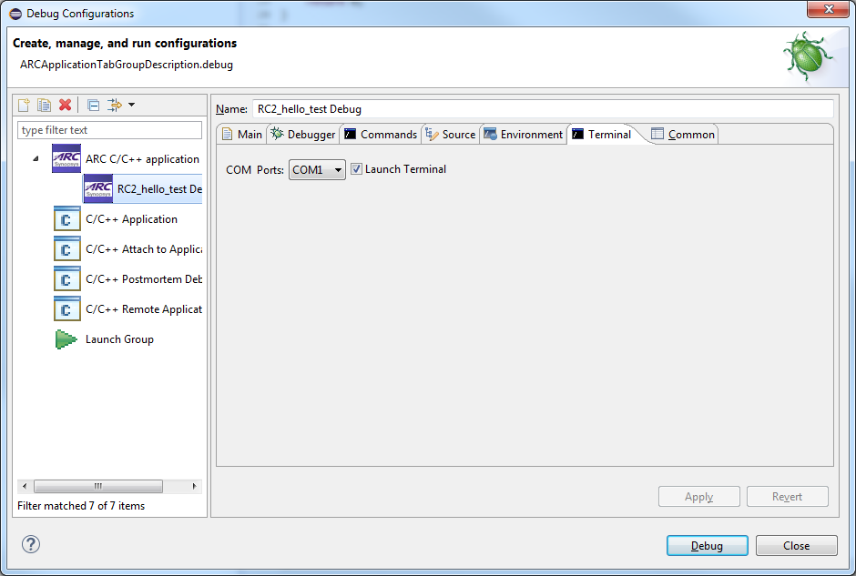
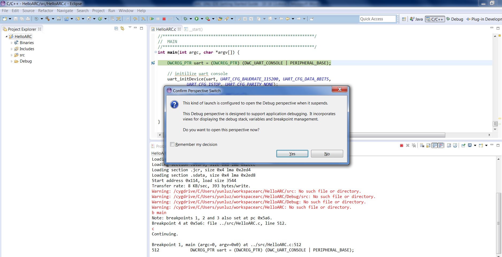
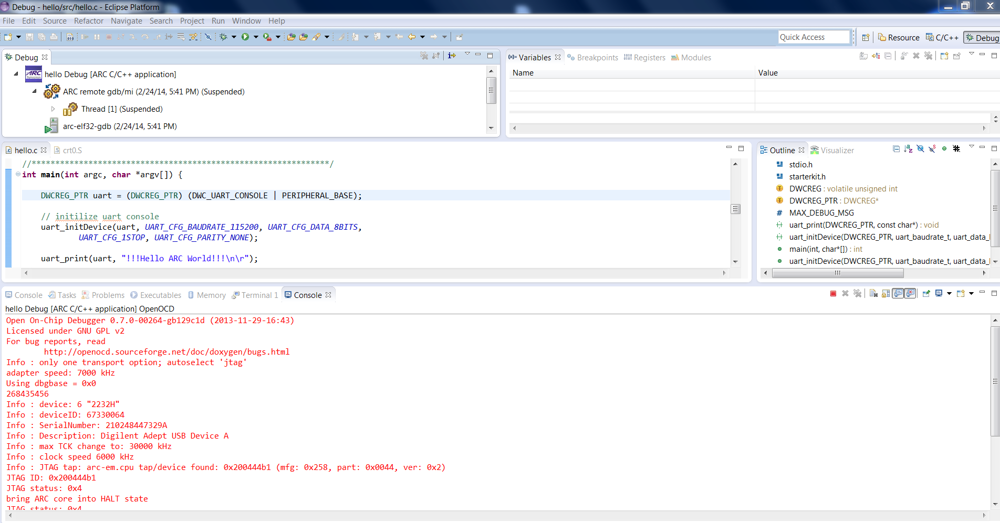
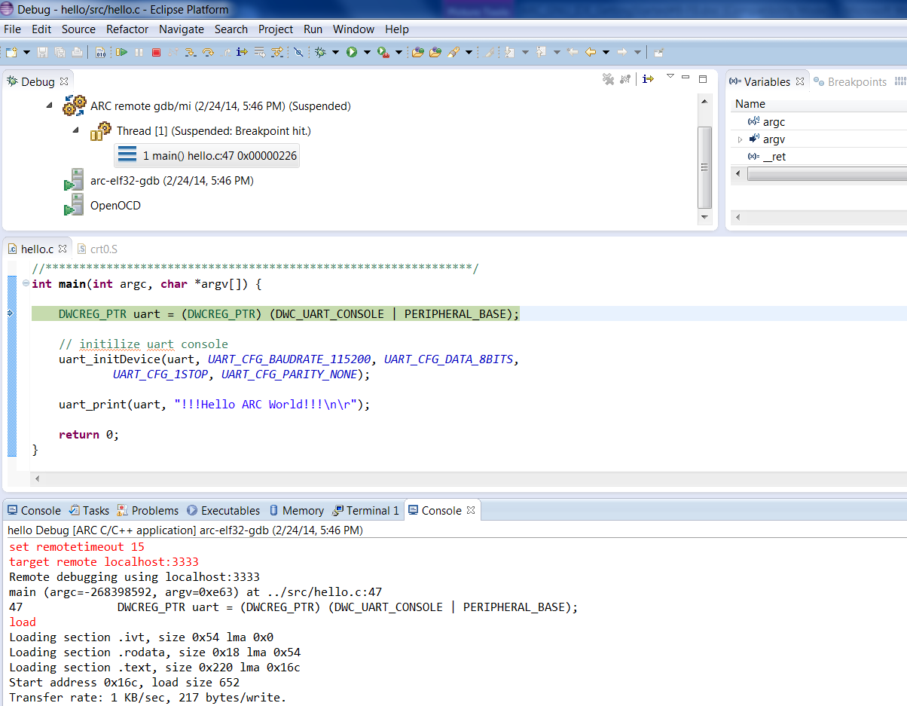
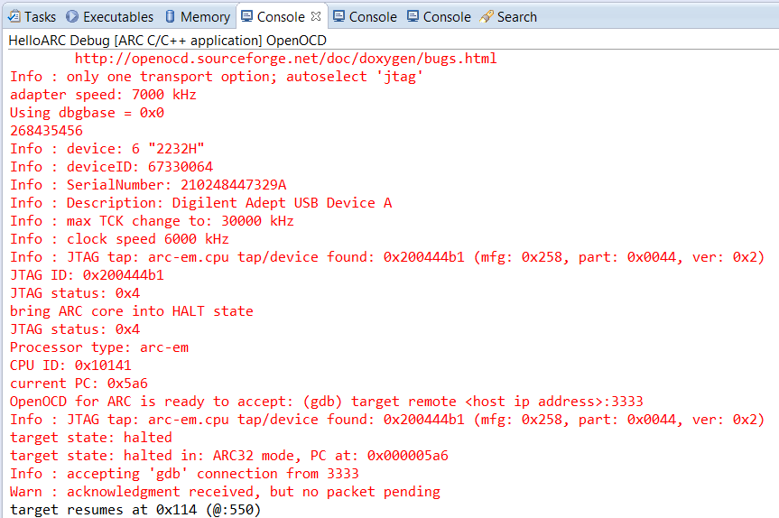
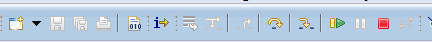
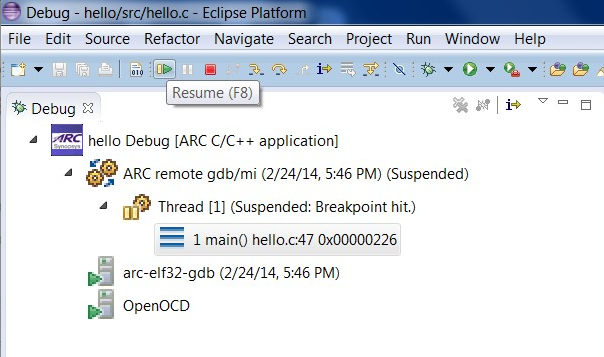
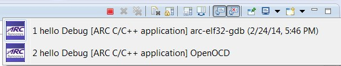

Creating a Debug Configuration for the C Project
------------------------------------------------

Once the C Project is successfully compiled by ARC GCC, you can debug the
resulting executable on the EM Starter Kit board.

To debug the project, create a new debug configuration using _arc-elf32-gdb_.

1. Select **Debug Configurations**  from the  **Run**  menu or by clicking on
the down arrow next to the bug icon:

    

    _Debug Configurations_

2. Double click on the **ARC C/C++ Application**  or click on the top left icon
to create a new debug configuration for the project:

    ![ARC Embedded Debug Configurations]
    (images/ARC Embedded Debug Configurations.png)

    _ARC Embedded Debug Configurations_

3. Select a name for the new debug configuration (by default, it equals the
project name followed by "Debug").

    

    _New debug Configuration_

4. Click the **Debugger** tab.

    ![Default values in the Debugger tab for JTAG via OpenOCD]
    (images/Default values in the Debugger tab for JTAG via OpenOCD_FTDI.jpg)

    _Default values in the Debugger tab for JTAG via OpenOCD_

    ![Default values in the GDBserver Debugger Options tab]

    Select the **JTAG via OpenOCD** or **JTAG via Ashling** for use with EM
    Starter Kit.

    The **"COM Ports" picklist** at "Terminal" tab shows the value for Digilent
    USB Serial Port from the Windows registry. You can modify the value as
    desired, but the selection must match the port number in Device and
    Printers as shown in below.

    

    _Digilent USB Serial COM Port_

    

    _USB Serial COM Port_

5. Click the **Debug** button in the **Debug configurations** dialog to
initiate debug session.

    This action automatically launches the Serial terminal and OpenOCD
    applications in the background and   connects to the UART on the EM Starter
    Kit board.

6. Click **Yes** in the confirmation dialog to switch to the Debug perspective

    

    _Perspective Switch_

    

    _Launch of OpenOCD_

    

    _Launch of Serial terminal_

7. Click the **Debug** button in the **Debug configurations** dialog to
initiate the debug session:

    

    _Debugging Process_

Debugging an Application
------------------------

The **Debug** perspective provides an integrated debug environment with
individual windows to display various debugging data such as the debug stack,
variables, registers  breakpoints, etc.

_Debug Perspective_

1. To set a breakpoint, place your cursor on the marker bar along the left edge
of the editor window on the line where you want the breakpoint:

    ![Source File Window in Debug Perspective with Breakpoint Set]
    (images/Source File Window in Debug Perspective with Breakpoint Set.png)

    _Source File Window in Debug Perspective with Breakpoint Set_

2. Examine Variables, Breakpoints, Expressions or Registers from different tabs
of the same debug perspective:

    ![Registers Window in Debug Perspective]
    (images/Registers Window in Debug Perspective.png)

    _Registers Window in Debug Perspective_

3. Examine the debug Views showing the debugger in use:

    ![Debug Window in Debug Perspective]
    (images/Debug Window in Debug Perspective.png)

    _Debug Window in Debug Perspective_

    ![Hello ARC Debug Console in Debug Perspective]
    (images/Hello ARC Debug Console in Debug Perspective.png)

    _Hello ARC Debug Console in Debug Perspective_

4. Switch Console tabs to view OpenOCD **Console** output:

    ![Multiple Consoles in the Debug Perspective]
    (images/Multiple Consoles in the Debug Perspective.png)

    _Multiple Consoles in the Debug Perspective_

    ![Hello ARC Debug Console Output]
    (images/Hello ARC Debug Console Output.png)

    _Hello ARC Debug Console Output_

    

    _OpenOCD Console Output_

5. Step through each line by using F5 (step into), and F6 (step over).

    

    _Stepping Toolbar_

6. Toggle breakpoint at the last line of main(), which is "}" , and then
clicking Resume or pressing F8.

    

    _Click Resume or Press F8_

    ![Final Output Printed to Serial Terminal Window through UART]
    (images/Final Output Printed to Serial Terminal Window through UART.png)

    _Final Output Printed to Serial Terminal Window through UART_
 
7. Terminate all external tools before you quit current debugging process.

    

    _Consoles for child processes_

