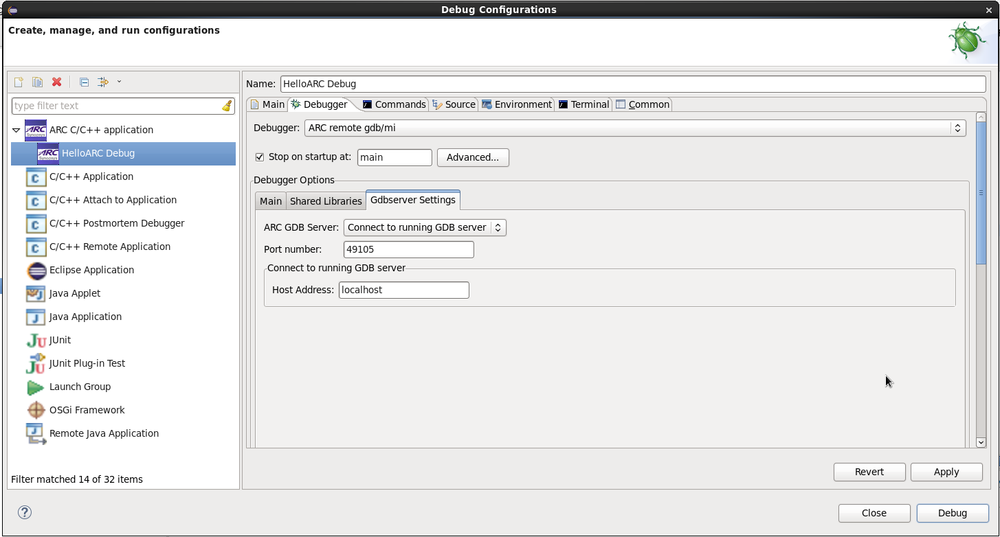
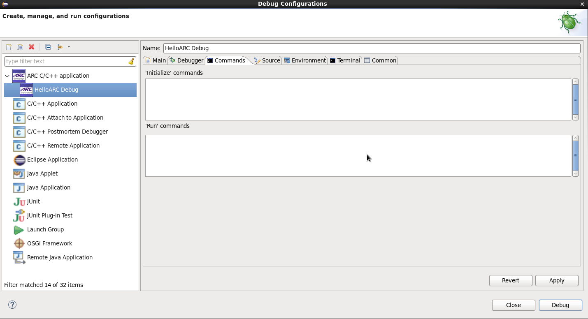
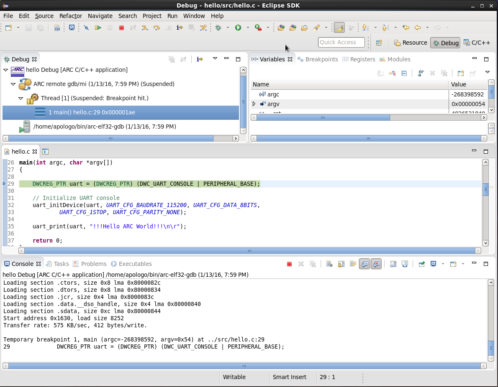
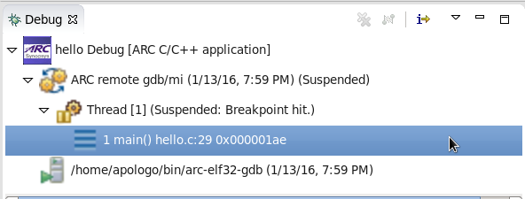
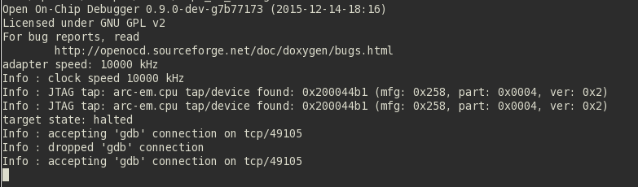

It is expected here that you have already built your application and created a
 debug configuration for it. About how to do it you can read on the following
pages:
* [Building an Application](Building-User-Guide)
* [Creating a Debug Configuration](Creating-a-Debug-Configuration)

### Running GDB server properties

_Connect to running GDB server tab_

If you want to connect to a GDB server that is already running, you should choose
a host address and also specify commands to be passed to the GDB client on the
**Commands** tab.

_Commands tab_

### OpenOCD as running GDB server

If you have a running OpenOCD server, you can connect to it just by choosing
**Connect to running GDB Server** under **ARC GDB Server** on **Debugger**
 tab and specifying port number and host address on which your OpenOCD is
 running. You do not need to specify any initialize commands for GDB in
 **Commands tab**, it will connect to OpenOCD using host address and port number
 from **Debugger** tab.

 _Debugging using running GDB server_

  _Debug window_

  _OpenOCD output in console_
