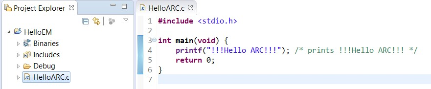
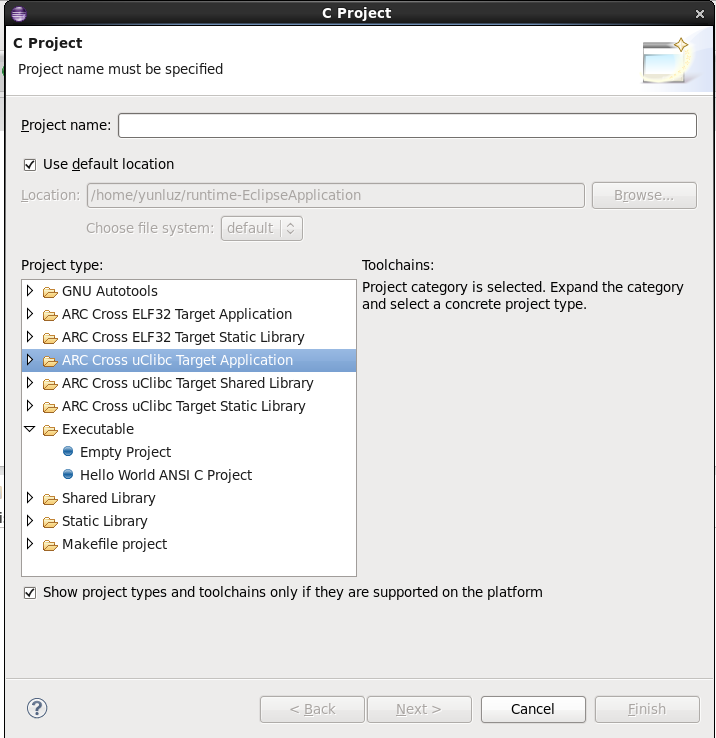
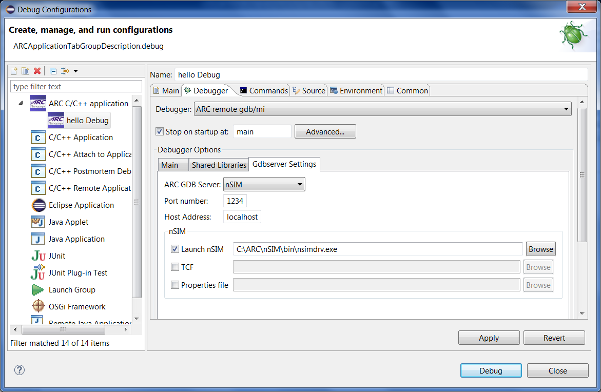
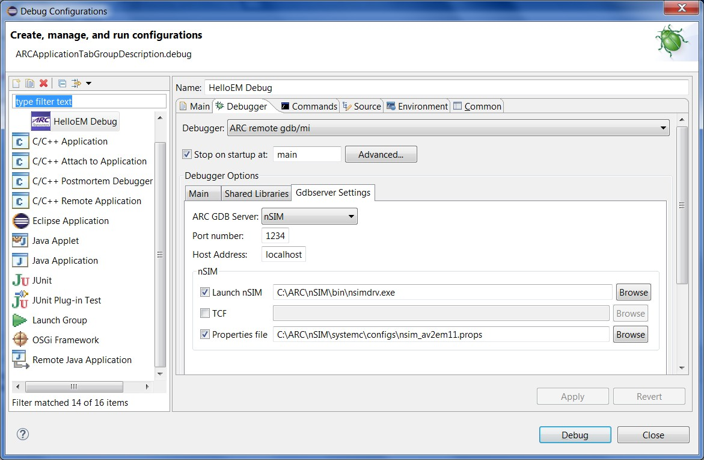
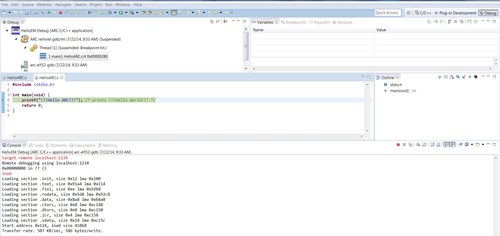
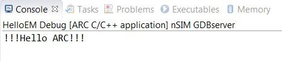

1. Creating C project
    
  

    _C Project for nSIM debugging_
  
  

    _C Project Types on Linux_
2. Choosing nSIM gdbserver under Debug Configuration
   
   
    
   _Choosing nSIM on debug tab_

   In this tab, user need to indicate correct properties file/TCF file for current CPU core. 
   
   
    
   _Choosing proper properties file for nSIM_
3. Debugging an ARC EM C project
   
   
    
   _Debugging with nSIM gdbserver_

   
     
   _nSIM gdbserver output in console_