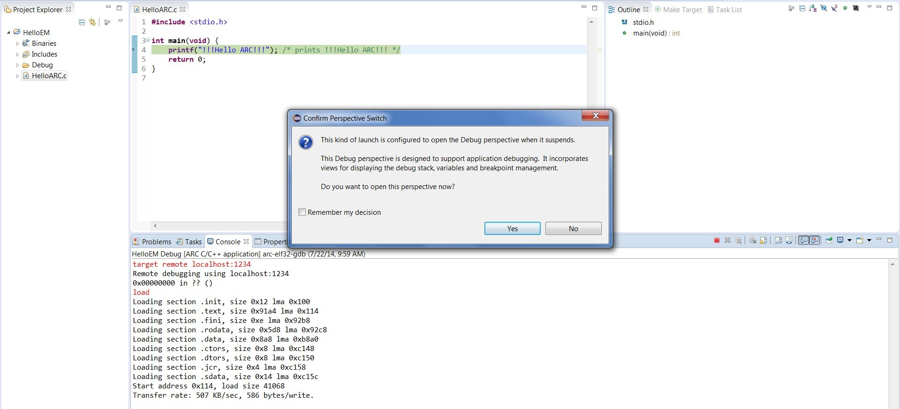
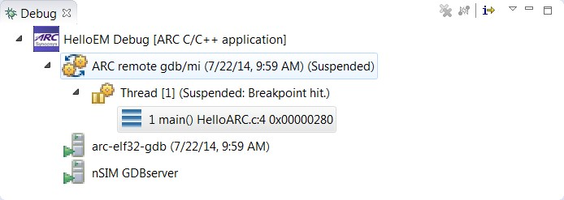
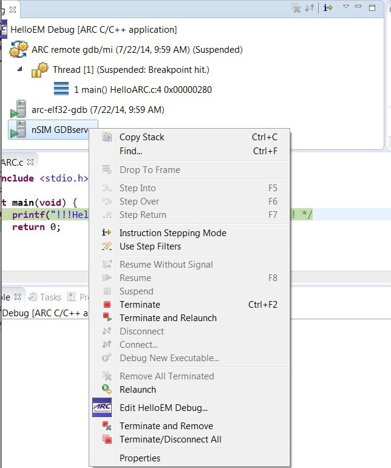

1. Creating C project
    
  

    _C Project for nSIM debugging_
  
2. Choosing nSIM gdbserver under Debug Configuration
   
   
    
   _Choosing nSIM on debug tab_

   In this tab, user need to indicate correct properties file/TCF file for
   current CPU core. In general it is recommended to use TCF files, because
   they are generated from the Build Configuration Registers and thus most
   reliably describe target core. nSIM Properties files contain list of
   key-values for nSIM properties which allow to describe target core and
   additional simulation features, full list of properties is documented in the
   nSIM User Guide.  It is possible to specify both TCF and properties file,
   with properties file being able to override parameters set in TCF. For
   example, if you have a TCF for a little endian core, but would like to
   simulate it as a big endian, it is possible to create an properties file
   that will set only a single property for big endian, then in IDE GUI in nSIM
   GDBserver settings specify bath to both TCF and properties file and that
   will give a desired results.
   
   

    To see output from the target application, go to **Common** tab and check
    "Allocate console (necessary for input)".

    ![Check “Allocate console” in Common Tab]
    (images/Check “Allocate console” in Common Tab.png)

    _Check “Allocate console” in Common Tab_

   _Choosing proper properties file for nSIM_
3. Debugging an ARC EM C project

To debug application using nSIM, press "Debug" button of IDE.
    
   
    
   _Start nSIM gdbserver debugging.jpg_  
   
   
    
   _Debugging with nSIM gdbserver_

   
    
   _Debug Window_

   
     
   _Open nSIM gdbserver properties_

   
     
   _nSIM gdbserver properties_

   
     
   _nSIM gdbserver output in console_

