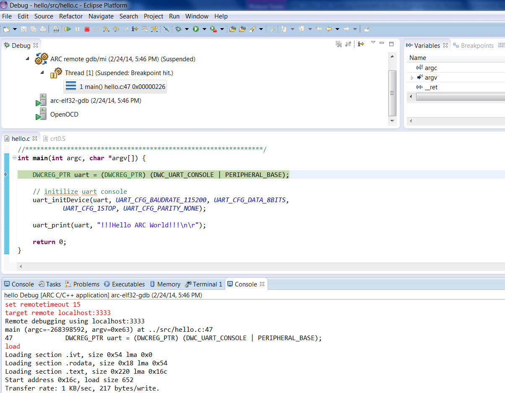

Creating Hello World project for ARC EM Starter Kit
------------------------

1. Select **File >New >C Project**

    

    _Creating a new C project_

    The **C Project** window should have several ARC project types:
**ARC Cross ELF32 Target Application**, **ARC Cross ELF32 Target Static
Library**, **AXS10x Projects** and **EM Starter Kit Projects**. Select
**EM Starter Kit Projects**. This project type is available only if ARC EM
toolchain compiler can be found either in `PATH` environment variable or
in `../bin/` directory relative to Eclipse executable.

2. Enter a project name

   

   _C Project Creation Dialog_

   1. Under **EM Starter Kit Projects** select **Hello World for EM SK
2.1 Project** (or **Hello World for EM SK 1.1** depending on your EM Starter Kit
version). This Hello World project is an example project that
   comes with the EM Starter Kit Software and uses the UART on the EM Starter
   Kit to display output. To see output printer to UART, connection to serial
   port should be established. By default Eclipse for ARC will automatically
   connect to available serial port, but that feature can be disabled and in
   that case refer to the EM Starter Kit Getting Started for instructions on
   how to connect to the UART on the EM Starter Kit board using Putty.

   2. Fill in project name and click **Finish** or **Next** if you want to
fill in additional information.

The resulting Hello World project created in Eclipse is:

_Final Hello World Project in Eclipse_

Building the project
------------------

1. Right click on the _Hello World project_ and select **Build Project** from the pop-up menu

    

    _Building a Project_

2. Review the build output log in the Eclipse console tab to confirm success:

    

    _Build Output_

Debugging the project
----------------

Once the project is successfully compiled by ARC GCC, you can debug the
resulting executable on the EM Starter Kit board.

> If you are using Windows platform, please configure drivers for your EM Starter
> Kit before you begin debug process. For the instructions see
> [How to use OpenOCD on Windows](How-to-Use-OpenOCD-on-Windows).

To debug the project, create a new debug configuration.

1. Select **Debug Configurations**  from the  **Run**  menu or by clicking on
the down arrow next to the bug icon:

    

    _Debug Configurations_

2. Double click on the **ARC C/C++ Application**  or click on the top left icon
to create a new debug configuration for the project:

    ![ARC Embedded Debug Configurations]
    (images/debugging/arc_debug_configurations.png)

    _ARC Embedded Debug Configurations_

3. Select a name for the new debug configuration (by default, it equals the
project name followed by "Debug").

    

    _New debug Configuration_

4. Click the **Debugger** tab and select **Gdbserver Settings** page.

    ![Default values in the Debugger tab for JTAG via OpenOCD]
    (images/debugging/debugger_tab_default.jpg)

    _Default values in the Debugger tab for JTAG via OpenOCD_

    Select **EM Starter Kit v2.x** or **EM Starter Kit v1.x** as development
 system depending on your EM Starter Kit version.

    Open **Terminal** tab and select COM Port. For Linux choose
    **/dev/ttyUSB1**. For Windows COM Port should match the port number in
    "Device and Printers" as shown below.

    

    _Digilent USB Serial COM Port_

    

    _USB Serial COM Port_

5. Click the **Debug** button in the **Debug configurations** dialog to
initiate debug session.

    This action automatically launches the Serial terminal and OpenOCD
    applications in the background and   connects to the UART on the EM Starter
    Kit board.

6. Click **Yes** in the confirmation dialog to switch to the Debug perspective

    

    _Perspective Switch_

    

    _Debugging Process_

