### Creating a C project

1. Select **File >New >C Project**

  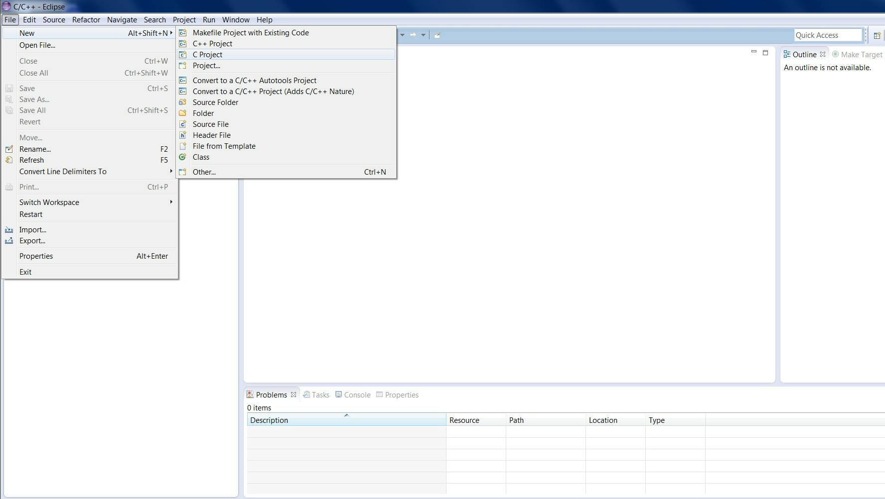

    _Creating a new C project_

  In **C Project** window select **Hello World C Project** under **ARC Cross ELF32 Target Application** project type.
  On the right side of the window there is a list of available toolchains, select **GNU Toolchain for ARC EM**.
  If you do not see this toolchain in the list or this project type in the list of project types, make sure that ARC EM
  toolchain compiler is in the `PATH` environment variable or at `../bin/` directory relative to Eclipse executable.

2. Enter a project name

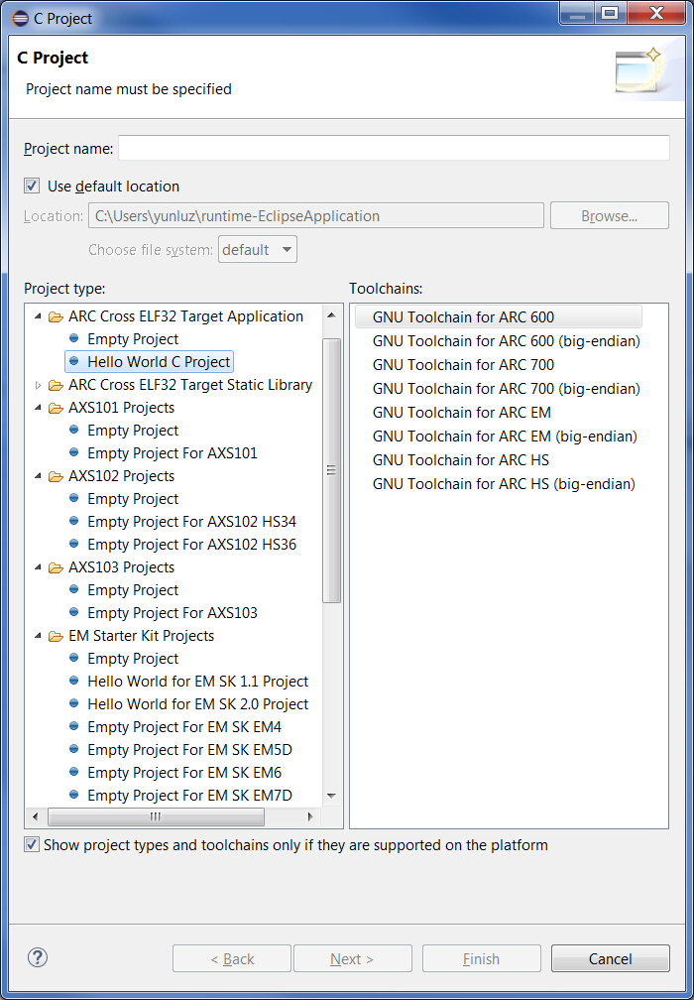

  _C Project Creation Dialog_

After that you can click **Finish** or you can click **Next** and fill in additional information about your project.

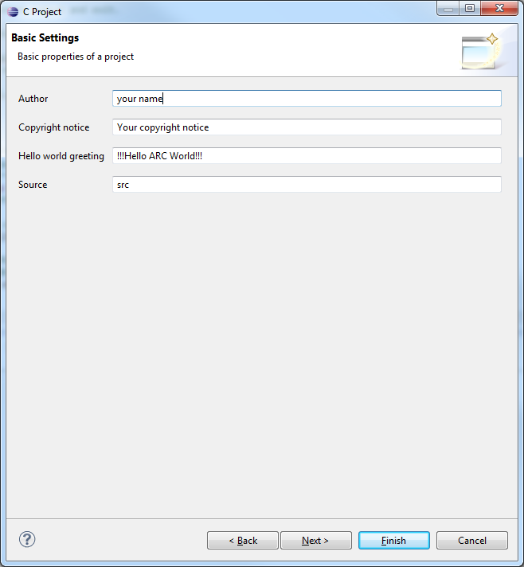

  _C project creation: Additional information Dialog_

Select the desired configuration and click **Finish**.

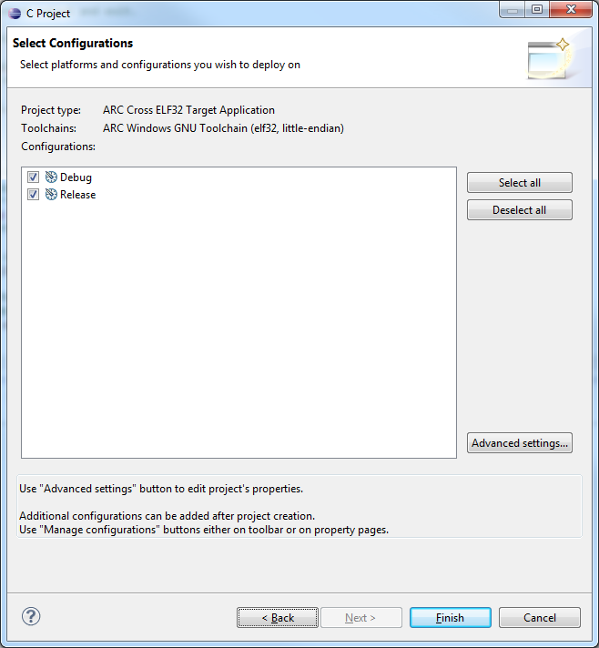

  _C Project creation: Configurations Dialog_

The resulting Hello World project created in Eclipse is:

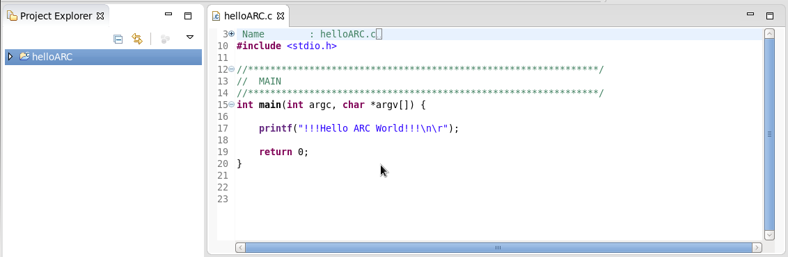

  _C Project for nSIM debugging_

### Building the project

1. Right click on the _Hello World project_ and select **Build Project** from the pop-up menu

    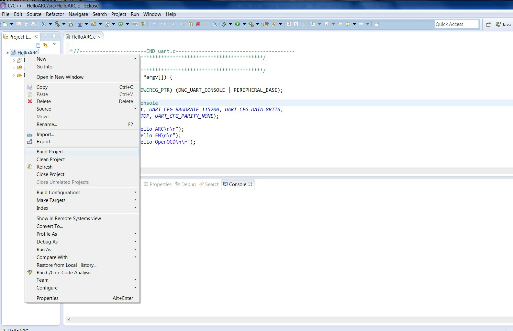

    _Building a Project_

2. Review the build output log in the Eclipse console tab to confirm success:

    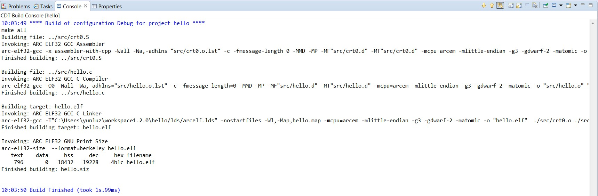

    _Build Output_

### Debugging the project

1. Select **Debug Configurations**  from the  **Run**  menu or by clicking on
the down arrow next to the bug icon:

    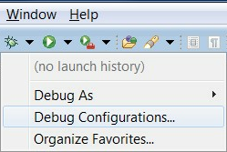

    _Debug Configurations_

2. Double click on the **ARC C/C++ Application**  or click on the top left icon
to create a new debug configuration for the project:

    ![ARC Embedded Debug Configurations]
    (images/debugging/arc_debug_configurations.png)

    _ARC Embedded Debug Configurations_

3. Select a name for the new debug configuration (by default, it equals the
project name followed by "Debug").

    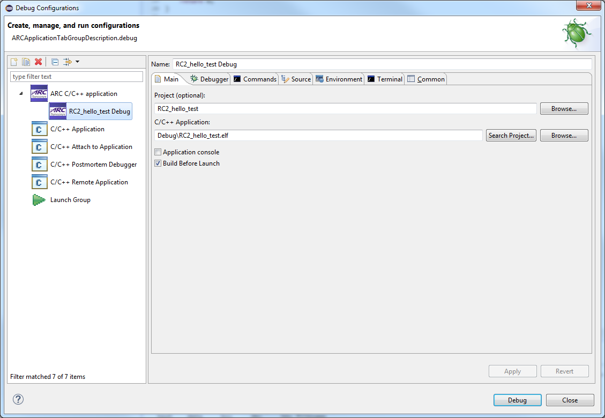

    _New debug Configuration_

4. Click the **Debugger** tab and select **Gdbserver Settings** page.

    ![Default values in the Debugger tab]
    (images/debugging/debugger_tab_default.jpg)

    _Default values in the Debugger tab_

  Select **nSIM** in the **ARC GDB Server** droplist.
   
   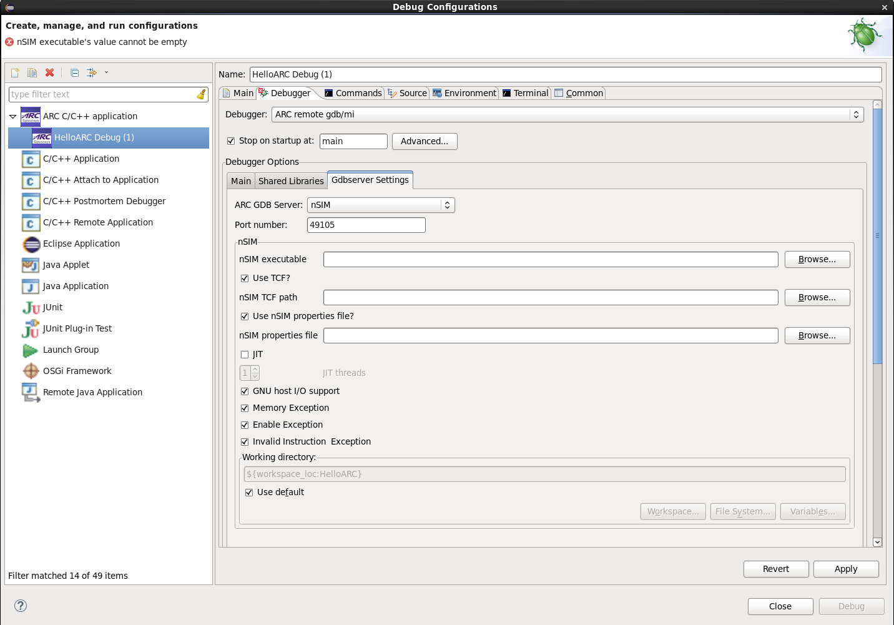
    
   _Choosing nSIM on debug tab_

  In this tab you should specify paths to nSIM executable and to a TCF file.
  nSIM has several TCF file templates in the folder `../etc/tcf/templates` relative
  to nSIM executable file. Choose *em6_dmips.tcf* file from templates. Then uncheck
  **Use nSIM properties file?** checkbox and click **Apply** button.

5. To debug application using nSIM, press "Debug" button of IDE.
   
   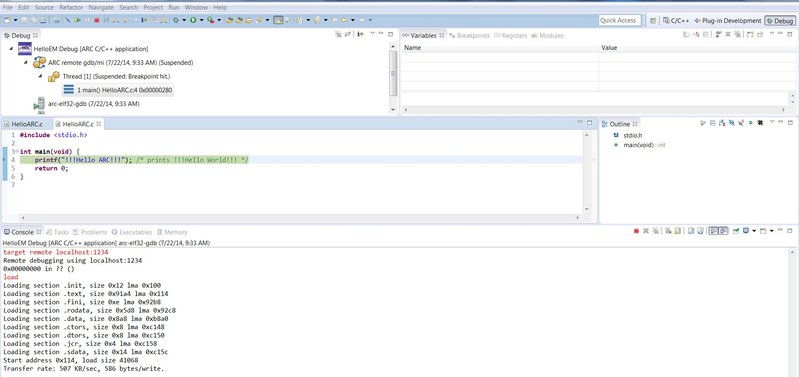
    
   _Debugging with nSIM gdbserver_

   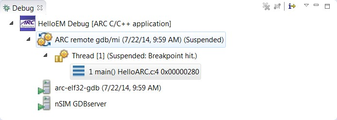
    
   _Debug Window_

   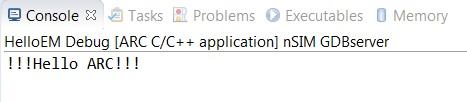
     
   _nSIM gdbserver output in console_

