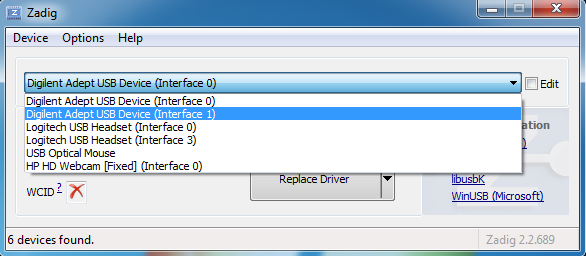
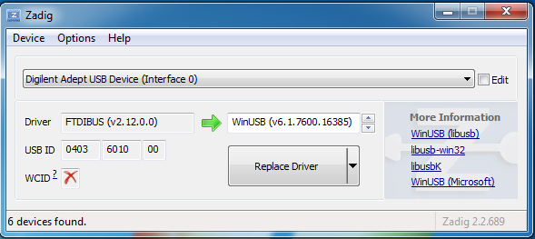

## Replacing a driver

Before you can start using OpenOCD, you have to download WinUSB driver and
replace with it one of FTDI drivers for your hardware development system.

To do that, download [Zadig](http://zadig.akeo.ie/) and run it. You should be
able to see **Digilent Adept USB Device** in the list of devices.

 _Device List_

If your device is not shown by Zadig, tick **List all devices** in **Options**. For
EM Starter Kit, select **Digilent Adept USB Device (Interface 0)**, choose
**WinUSB** driver and press **Replace Driver**. Your FTDI driver will be replaced
with WinUSB.

 _Zadig Dialog_

If you are using AXS10x board, the only thing that differs is that instead of
**Digilent Adept USB Device (Interface 0)** you should select **Digilent Adept USB
Device (Interface 1)**.

Note that antivirus might complain about drivers files created by Zadig.

> If you want to change driver for your device back for some reason, you can
> uninstall current driver in "Devices and Printers" and then reconnect your board
> to the computer, Windows will install the driver automatically.

