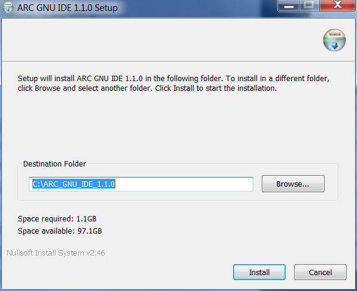
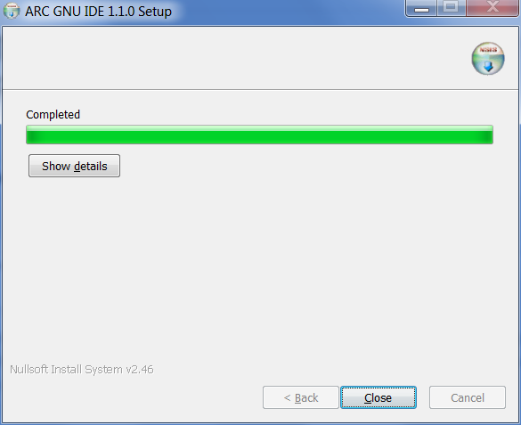
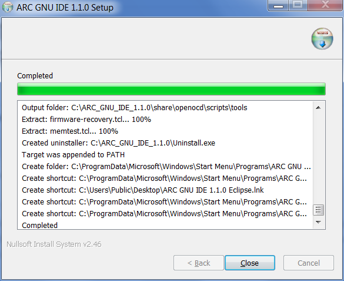
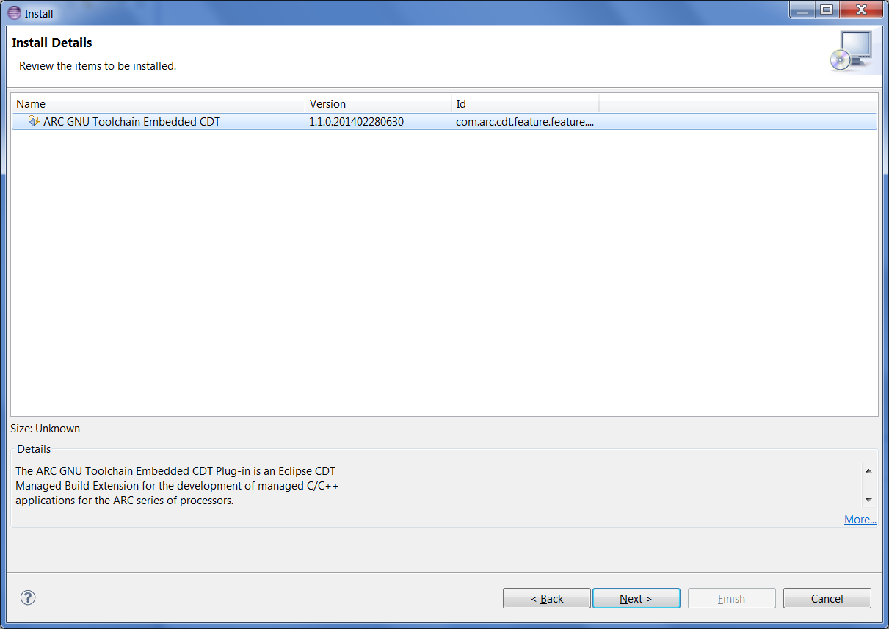
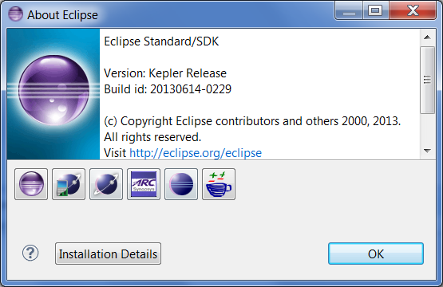
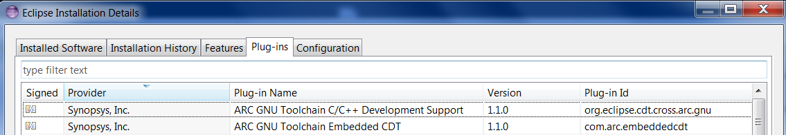

Prerequisites
-------------

ARC GNU plugins for Eclipse have following requirements to the system:
* Eclipse version 4.3 (Kepler)
* CDT version 8.2.1
* OS: RHEL 6 or Windows 7
* On Linux both 32bit and 64-bit versions of Eclipse are supported, on Windows
only 32-bit Eclipse installations are supported.  Eclipse 64-bit installation
is not supported, so it is required to run 32-bit version of Eclipse on
64-bit Windows versions, to overcome this limitation.
* Java VM version >= 1.6 is required

Using installer for Windows
---------------------------

ARC GNU IDE should be installed in the path no longer than 50 characters and
cannot contain white spaces.

![Run ARC_GNU_IDE_1.1.0_win_install.exe]
(images/Run ARC_GNU_IDE_1.1.0_win_install.exe.png)

_Run ARC_GNU_IDE_1.1.0_win_install.exe_

_Choose installer paths_

_Installation Completed_

_Click “Show details” button_

Downloading latest plugins
--------------------------

User can get this plug-in from website URL
<https://github.com/foss-for-synopsys-dwc-arc-processors/arc_gnu_eclipse/releases>,
this is an archived version of the GNU ARC Eclipse plug-in update site, the
file name is arc_gnu_plugins.zip

![Components of ARC_GNU_IDE_plugins.zip]
(images/components_of_arc_gnu_plugins.zip.png)

_Figure 1 Components of arc_gnu_plugins.zip_

![Components of arc_gnu_plugins.zip/features]
(images/Components of arc_gnu_plugins.zip features.png)

_Figure 2 Components of arc_gnu_plugins.zip features_

![Components of arc_gnu_plugins.zip_plugins]
(images/Components of arc_gnu_plugins.zip_plugins.png)

_Figure 3 Components of arc_gnu_plugins.zip_plugins_

To run ARC_GNU_IDE plugins, you need to install Target Terminal plugin. The url
for Kepler’s update site is <http://download.eclipse.org/releases/kepler>, then
select: Mobile and Device Development, especially Target Management Terminal
which is "An ANSI (vt102) compatible Terminal including plug-ins for Serial,
SSH and Telnet connections."

![Figure 4 Installation of Eclipse terminal plugin]
(images/Figure 4 Installation of Eclipse terminal plugin.png)

_Figure 4 Installation of Eclipse terminal plugin_

Installing into Eclipse
-----------------------

After downloading arc_gnu_plugins.zip successfully, user also can install it
from local by pointing Eclipse to it: `Eclipse -> Install New Software -> Add ->
Archive ->` select arc_gnu_plugins.zip file. Unzip this archived folder, there
will be six components in it.

![Figure 5 Install from local PC]
(images/Figure 5 Install from local PC.png)

_Figure 5 Install from local PC_

![Figure 6 Check GNU ARC C++ Development Support]
(images/Figure 6 Check GNU ARC C++ Development Support.png)

_Figure 6 Check GNU ARC C++ Development Support_

![Figure 7 Get copyright by clicking “more”]
(images/Figure 7 Get copyright by clicking “more”.png)

_Figure 7 Get copyright by clicking “more”_

![Figure 8 Get General Information by clicking “more”]
(images/Figure 8 Get General Information by clicking “more”.png)

_Figure 8 Get General Information by clicking “more”_

![Figure 9 Get License Agreement by clicking “more”]
(images/Figure 9 Get License Agreement by clicking “more”.png)

_Figure 9 Get License Agreement by clicking “more”_

_Figure 10 Install Details_

![Figure 11 Accept the terms of license agreement]
(images/Figure 11 Accept the terms of license agreement.png)

_Figure 11 Accept the terms of license agreement_

![Figure 12 Install ARC GNU IDE Plugin]
(images/Figure 12 Install ARC GNU IDE Plugin.png)

_Figure 12 Install ARC GNU IDE Plugin_

![Figure 13 Warning about this plugins installation]
(images/Figure 13 Warning about this plugins installation.png)

_Figure 13 Warning about this plugins installation_

_Figure 14 Restarting Eclipse_

Ignore the Security Warning, and click “Ok”, after restarting Eclipse IDE, the
installation is finished. If user install plug-in successfully, the “ARC” icon
will show up in “About Eclipse”.

_Figure 15 Plug-in in Eclipse IDE_

Click the “ARC” icon; user will get detailed plug-in features information.

![Figure 16 About Eclipse ELF32 Plug-in Features]
(images/Figure 16 About Eclipse ELF32 Plug-in Features.png)

_Figure 16 About Eclipse ELF32 Plug-in Features_

Click the “Installation Details” button, the Features and Plug-ins will also show up.

_Figure 17 ARC GNU plugin Plug-ins_

_Figure 18 ARC GNU plugin Features_

Updating existing plugin
------------------------

If users want to update the existing plugin, as shown in figure as below, and
the version of this current plugin is for example “1.1.0.201402280630”, they
can update it by using the same way of plugin installation.

![Figure 18 ARC GNU plugin Features]
(images/Figure 18 ARC GNU plugin Features.png)

_Figure 18 ARC GNU plugin Features_

![Figure 19 Current ARC GNU IDE plugin]
(images/Figure 19 Current ARC GNU IDE plugin.png)

_Figure 19 Current ARC GNU IDE plugin_

![Figure 20 Installation of latest plugin]
(images/Figure 20 Installation of latest plugin.png)

_Figure 20 Installation of latest plugin_

![Figure 21 Updated ARC GNU IDE plugin]
(images/Figure 21 Updated ARC GNU IDE plugin.png)

_Figure 21 Updated ARC GNU IDE plugin_

![Figure 22 General Information of the latest plugin]
(images/Figure 22 General Information of the latest plugin.png)

_Figure 22 General Information of the latest plugin_

![Figure 23 Installed details of the latest plugin]
(images/Figure 23 Installed details of the latest plugin.png)

_Figure 23 Installed details of the latest plugin_

![Figure 24 Upate exiting plugins successfully]
(images/Figure 24 Upate exiting plugins successfully.png)

_Figure 24 Upate exiting plugins successfully_

![Figure 25 Updated ARC GNU plugin Features]
(images/Figure 25 Updated ARC GNU plugin Features.png)

_Figure 25 Updated ARC GNU plugin Features_

![Figure 26 Updated ARC GNU plugin Plug-ins]
(images/Figure 26 Updated ARC GNU plugin Plug-ins.png)

_Figure 26 Updated ARC GNU plugin Plug-ins_

Installing plugin on Linux host
-------------------------------

If you plan to connect to UART port on target board with RxTx plugin controlled
by IDE you need to change permissions of dicrectory /var/lock in your system.
Usually by default only users with root access are allowed to write into this
directory, however RxTx tries to write file into this directory, so unless you
are ready to run IDE with sudo, you need to allow write access to /var/lock
directory for everyone. Note that if /var/lock is a symbolic link to another
directory then you need to change permissions for this directory as well. For
example to set required permissions on Fedora:

    $ ls -l /var/lock
    lrwxrwxrwx. 1 root root 11 Jun 27  2013 /var/lock -> ../run/lock
    $ ls -ld /run/lock/
    drwxr-xr-x. 8 root root 160 Mar 28 17:32 /run/lock/
    $ sudo chmod go+w /run/lock
    $ ls -ld /run/lock/
    drwxrwxrwx. 8 root root 160 Mar 28 17:32 /run/lock/

If you don’t want or can’t change permissions for this directory then you need
to disable serial port in debugger configuration window.

