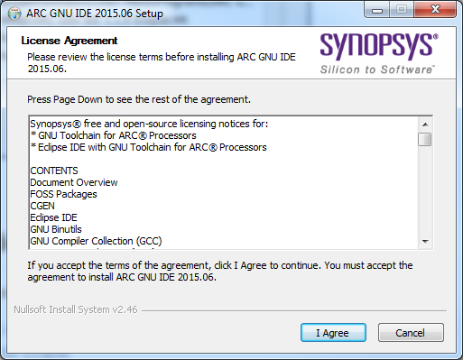
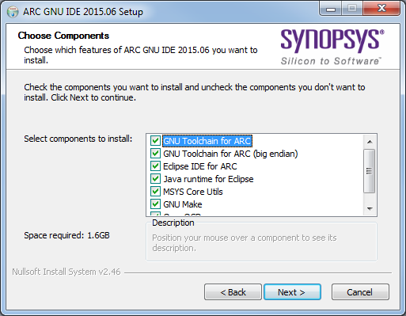
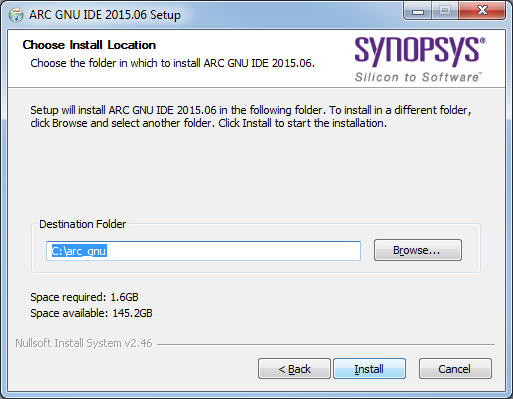
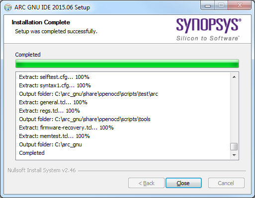
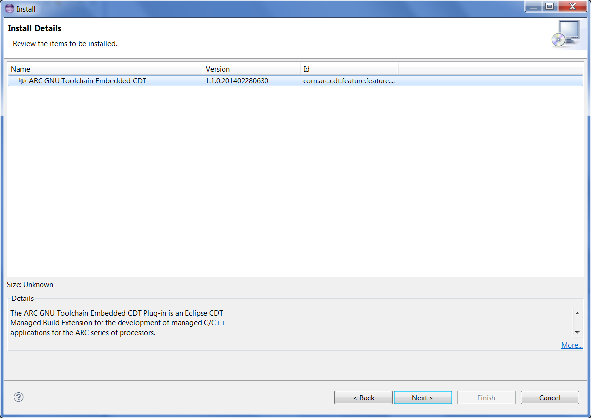
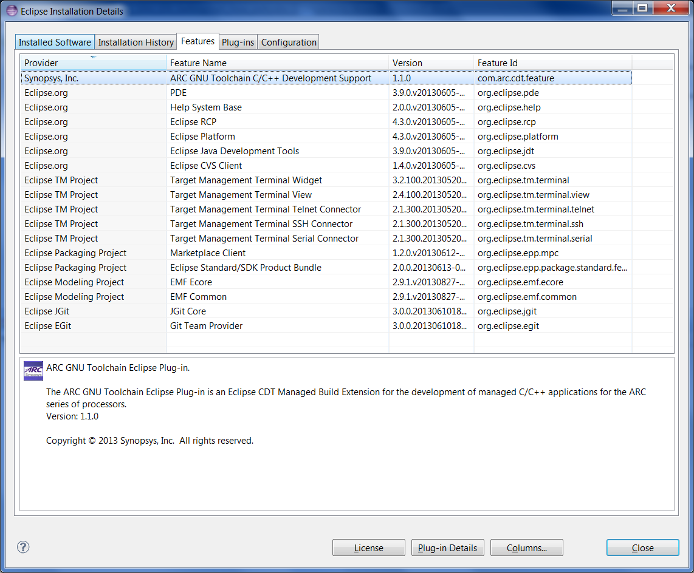
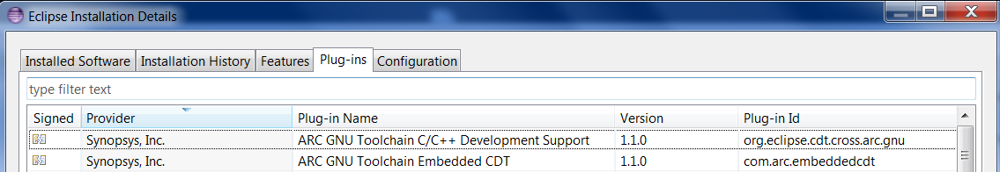

Table of Contents
-----------------

* [Prerequisites](#1-prerequisites)
* [Using installer for Windows](#2-using-installer-for-windows)
* [Manual installation on Linux and Windows](#3-manual-installation-on-linux-and-windows)
  * [Downloading latest plugins](#31-downloading-latest-plugins)
  * [Installing into Eclipse](#32-installing-into-eclipse)
* [Updating existing plugin](#4-updating-existing-plugin)
* [Installing plugin on Linux host](#5-installing-plugin-on-linux-host)

1. Prerequisites
----------------

ARC GNU plugins for Eclipse have following requirements to the system:
* OS: RHEL 6 or Windows 7
* Eclipse version >= 4.4 (part of Windows installer)
* CDT version 8.5.0 (part of Windows installer)
* Java VM version >= 1.6 is required (part of Windows installer)
* On Linux both 32bit and 64-bit versions of Eclipse are supported, on Windows
only 32-bit Eclipse installations are supported.  Eclipse 64-bit installation
is not supported, so it is required to run 32-bit version of Eclipse on 64-bit
Windows versions, to overcome this limitation.

> ARC plugins for Eclipse have been found to have compatibility issues with
> Msys on Windows hosts. For ARC plugins for Eclipse to work properly it is
> required that Msys is not present in PATH environment variable.

2. Using installer for Windows
------------------------------

Windows users are advised to use our Windows installer for Eclisepse for GNU
Toolchain for IDE, that can be downloaded from this [releases
page](https://github.com/foss-for-synopsys-dwc-arc-processors/arc_gnu_eclipse/releases).
Installer already contains all of the necessary components.

ARC GNU IDE should be installed in the path no longer than 50 characters and
cannot contain white spaces.

![Run ARC_GNU_IDE_1.1.0_win_install.exe]
(images/install/run_arc_gnu_1.1.0_win_install.exe.png)

_Run arc_gnu_2015.06_ide_win_install.exe_

_Accept Synopsys FOSS notice_

_Choose components to be installed_

_Choose installer paths_

_Installation Completed_

3. Manual installation on Linux and Windows
-------------------------------------------

To install Eclipse IDE for GNU Toolchain for ARC manually:

1. [Download Eclipse IDE for C/C++ Developers, that already contains CDT](https://www.eclipse.org/downloads/)
2. [Download latest ARC plugins for Eclipse](#31-downloading-latest-plugins)
2. [Install ARC plugins into Eclipse](#32-installing-into-eclipse)

### 3.1 Downloading latest plugins ###

User can get this plug-in from website URL
<https://github.com/foss-for-synopsys-dwc-arc-processors/arc_gnu_eclipse/releases>,
this is an archived version of the GNU ARC Eclipse plug-in update site, the
file name is arc_gnu_plugins.zip

![Components of ARC_GNU_IDE_plugins.zip]
(images/components_of_arc_gnu_plugins.zip.png)

_Components of arc_gnu_plugins.zip_

![Components of arc_gnu_plugins.zip/features]
(images/Components of arc_gnu_plugins.zip features.png)

_Components of arc_gnu_plugins.zip features_

![Components of arc_gnu_plugins.zip_plugins]
(images/Components of arc_gnu_plugins.zip_plugins.png)

_Components of arc_gnu_plugins.zip_plugins_

### 3.2 Installing into Eclipse ###

To run ARC plugins for Eclipse, it is required to have Target Terminal plugin
installed in Eclipse. In Eclipse go to "Help", then "Install new Software",
select "Luna" in "Work with" combo box, then select Target Management Terminal
which is "An ANSI (vt102) compatible Terminal including plug-ins for Serial,
SSH and Telnet connections."

![Installation of Eclipse terminal plugin]
(images/install/installation_of_eclipse_terminal_plugin.png)

_Installation of Eclipse terminal plugin_

After downloading arc_gnu_plugins.zip successfully, user also can install it
from local by pointing Eclipse to it: `Eclipse -> Install New Software -> Add ->
Archive ->` select arc_gnu_plugins.zip file. Unzip this archived folder, there
will be six components in it.

![Install from local PC]
(images/install/install_from_local_pc.png)

_Install from local PC_

![Check GNU ARC C++ Development Support]
(images/install/check_gnu_arc_c++_development_support.png)

_Check GNU ARC C++ Development Support_

![Get copyright by clicking "more"]
(images/install/get_copyright_by_clicking_more.png)

_Get copyright by clicking "more"_

![Get General Information by clicking "more"]
(images/install/get_general_information_by_clicking_more.png)

_Get General Information by clicking "more"_

![Get License Agreement by clicking "more"]
(images/install/get_license_agreement_by_clicking_more.png)

_Get License Agreement by clicking "more"_

_10 Install Details_

![Accept the terms of license agreement]
(images/install/accept_the_terms_of_license_agreement.png)

_Accept the terms of license agreement_

![Install ARC GNU IDE Plugin]
(images/install/install_arc_gnu_ide_plugin.png)

_Install ARC GNU IDE Plugin_

![Warning about this plugins installation]
(images/install/warning_about_this_plugin_installation.png)

_Warning about this plugins installation_

_Restarting Eclipse_

Ignore the Security Warning, and click "Ok", after restarting Eclipse IDE, the
installation is finished. If user install plug-in successfully, the "ARC" icon
will show up in "About Eclipse".

_Plug-in in Eclipse IDE_

Click the "ARC" icon; user will get detailed plug-in features information.

![About Eclipse ELF32 Plug-in Features]
(images/install/about_eclipse_elf32_plug-in_features.png)

_About Eclipse ELF32 Plug-in Features_

Click the "Installation Details" button, the Features and Plug-ins will also show up.

_ARC GNU plugin Plug-ins_

_ARC GNU plugin Features_

4. Updating existing plugin
---------------------------

To update the existing plugin, as shown in the figure below, and
the version of this current plugin is for example "1.1.0.201402280630",
follow same instructrions as plugin installation.

![ARC GNU plugin Features]
(images/install/arc_gnu_plugin_features.png)

_ARC GNU plugin Features_

![Current ARC GNU IDE plugin]
(images/install/current_arc_gnu_ide_plugin.png)

_Current ARC GNU IDE plugin_

![Installation of latest plugin]
(images/install/installation_of_latest_plugin.png)

_Installation of latest plugin_

![Updated ARC GNU IDE plugin]
(images/install/updated_arc_gnu_ide_plugin.png)

_Updated ARC GNU IDE plugin_

![General Information of the latest plugin]
(images/install/general_information_of_the_latest_plugin.png)

_General Information of the latest plugin_

![Installed details of the latest plugin]
(images/install/installed_details_of_the_latest_plugin.png)

_Installed details of the latest plugin_

![Upate exiting plugins successfully]
(images/install/update_existing_plugins_sucessfully.png)

_Upate exiting plugins successfully_

![Updated ARC GNU plugin Features]
(images/install/updated_arc_gnu_plugin_features.png)

_Updated ARC GNU plugin Features_

![Updated ARC GNU plugin Plug-ins]
(images/install/updated_arc_gnu_plugin_plug-ins.png)

_Updated ARC GNU plugin Plug-ins_

5. Installing plugin on Linux host
----------------------------------

If you plan to connect to UART port on target board with RxTx plugin controlled
by IDE you need to change permissions of directory /var/lock in your system.
Usually by default only users with root access are allowed to write into this
directory, however RxTx tries to write file into this directory, so unless you
are ready to run IDE with sudo, you need to allow write access to /var/lock
directory for everyone. Note that if /var/lock is a symbolic link to another
directory then you need to change permissions for this directory as well. For
example to set required permissions on Fedora:

    $ ls -l /var/lock
    lrwxrwxrwx. 1 root root 11 Jun 27  2013 /var/lock -> ../run/lock
    $ ls -ld /run/lock/
    drwxr-xr-x. 8 root root 160 Mar 28 17:32 /run/lock/
    $ sudo chmod go+w /run/lock
    $ ls -ld /run/lock/
    drwxrwxrwx. 8 root root 160 Mar 28 17:32 /run/lock/

If it is not possible or not desirable to change permissions for this directory
then serial port connection must be disable in Eclipse debugger configuration
window.

Another problem that might happen is necessary permissions to open UART device.
For example on Ubuntu 14.04 only root and members of `dialout` group can use
/dev/ttyUSB1 (typical UART port for boards based on FT2232 chip). Thus to use
connect to those port user must be made member of `dialout` group. Command to
do this:

    $ sudo usermod -a -G plugdev `whoami`

