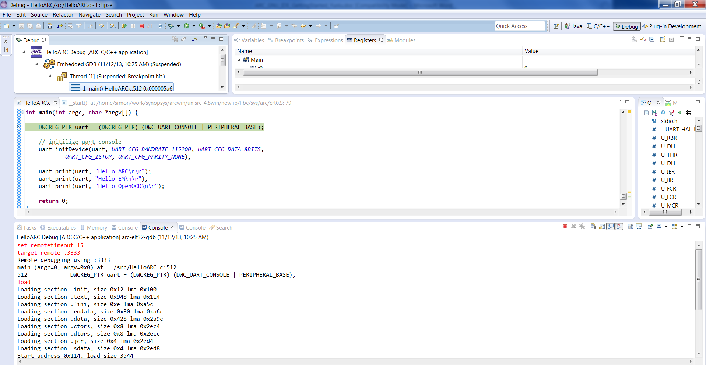
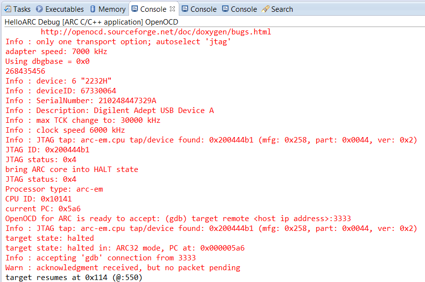
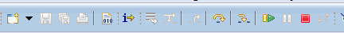
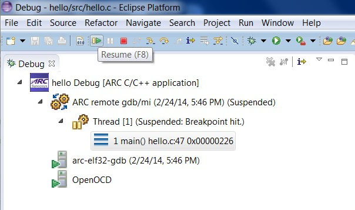
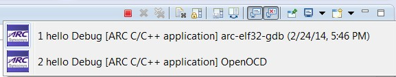

The **Debug** perspective provides an integrated debug environment with
individual windows to display various debugging data such as the debug stack,
variables, registers  breakpoints, etc.

_Debug Perspective_

1. To set a breakpoint, place your cursor on the marker bar along the left edge
of the editor window on the line where you want the breakpoint:

    ![Source File Window in Debug Perspective with Breakpoint Set]
    (images/debugging/using_perspective/set_breakpoint.png)

    _Source File Window in Debug Perspective with Breakpoint Set_

2. Examine Variables, Breakpoints, Expressions or Registers from different tabs
of the same debug perspective:

    ![Registers Window in Debug Perspective]
    (images/debugging/using_perspective/registers_window_debug_perspective.png)

    _Registers Window in Debug Perspective_

3. Examine the debug Views showing the debugger in use:

    ![Debug Window in Debug Perspective]
    (images/debugging/openocd/debug_window.png)

    _Debug Window in Debug Perspective_

    ![Hello ARC Debug Console in Debug Perspective]
    (images/debugging/using_perspective/debug_console.png)

    _Hello ARC Debug Console in Debug Perspective_

4. Switch Console tabs to view OpenOCD **Console** output:

    ![Multiple Consoles in the Debug Perspective]
    (images/debugging/using_perspective/multiple_consoles.png)

    _Multiple Consoles in the Debug Perspective_

    ![Hello ARC Debug Console Output]
    (images/debugging/gdb_console_output.png)

    _Hello ARC Debug Console Output_

    

    _OpenOCD Console Output_

5. Step through each line by using F5 (step into), and F6 (step over).

    

    _Stepping Toolbar_

6. Toggle breakpoint at the last line of main(), which is "}" , and then
click Resume or press F8.

    

    _Click Resume or Press F8_

7. To see the UART output, open Eclipse Terminal view.

  ![Final Output Printed to Serial Terminal Window through UART]
    (images/debugging/terminal_output.png)

    _Final Output Printed to Serial Terminal Window through UART_

  You will be able to see the output in the Terminal view only if COM port
  specified in **Terminal** tab of **Debug Configurations** dialog is right.
  Read more about specifying a COM port [here](Creating-a-Debug-Configuration#setting-a-com-port).

7. Terminate all external tools before you quit current debugging process.

    

    _Consoles for child processes_
